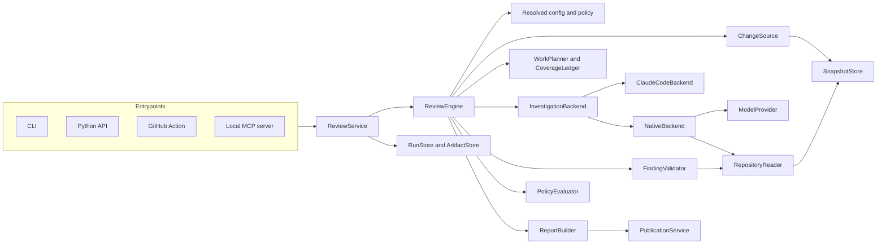
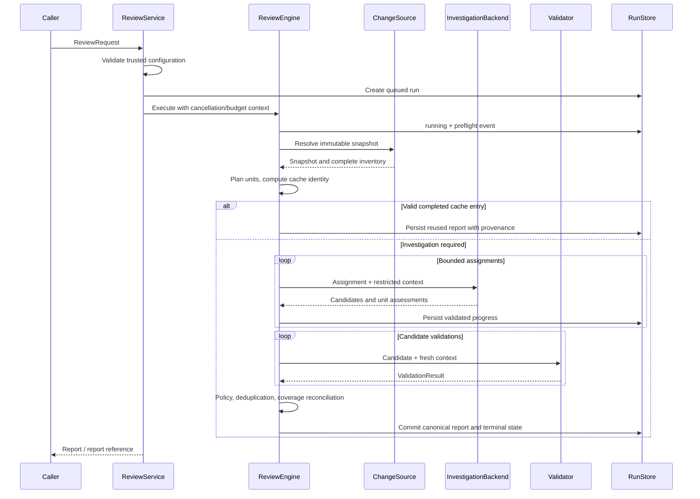
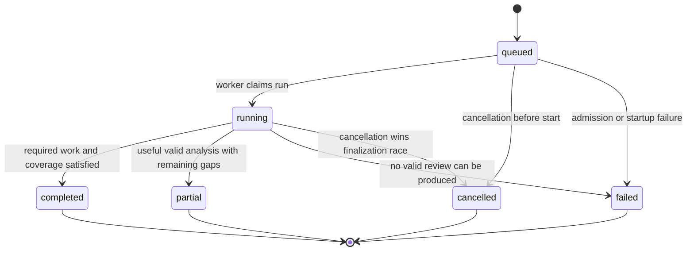

# Generic Agentic Security Reviewer: Technical Design

**Status:** Proposed implementation design  
**Version:** 0.1  
**Date:** 2026-09-15  
**Requirements:** [Generic Security Reviewer Requirements](generic-security-review-requirements.md)  
**Assessment:** [Repository Review](generic-tool-assessment.md)

This document describes the implementation to build, not capabilities already implemented. Requirement IDs refer to the requirements document. Its MUST requirements and milestone boundaries remain authoritative. Choices labeled proposed require validation during implementation; snippets describe contracts and algorithms rather than drop-in production code.

## Navigation

- [1. Design decisions](#1-design-decisions)
- [2. Components and package structure](#2-components-and-package-structure)
- [3. Public contracts](#3-public-contracts)
- [4. Configuration and trust](#4-configuration-and-trust)
- [5. Snapshot acquisition](#5-snapshot-acquisition)
- [6. Repository tools and evidence](#6-repository-tools-and-evidence)
- [7. Engine lifecycle](#7-engine-lifecycle)
- [8. Coverage and work planning](#8-coverage-and-work-planning)
- [9. Claude compatibility backend](#9-claude-compatibility-backend)
- [10. Native backend and model providers](#10-native-backend-and-model-providers)
- [11. Validation, policy, and fingerprints](#11-validation-policy-and-fingerprints)
- [12. Budgets, cancellation, and retries](#12-budgets-cancellation-and-retries)
- [13. Persistence, caching, and recovery](#13-persistence-caching-and-recovery)
- [14. CLI and Python API](#14-cli-and-python-api)
- [15. GitHub Action and publishing](#15-github-action-and-publishing)
- [16. MCP and framework adapters](#16-mcp-and-framework-adapters)
- [17. Security implementation](#17-security-implementation)
- [18. Reports and observability](#18-reports-and-observability)
- [19. Testing and evaluation](#19-testing-and-evaluation)
- [20. Migration and delivery slices](#20-migration-and-delivery-slices)
- [21. Requirement mapping and open decisions](#21-requirement-mapping-and-open-decisions)

## 1. Design decisions

The M0/M1 implementation now includes the shared engine, local/PR sources, sync/async API, CLI, persistence, policy, publishing and Action migration. See [implementation progress](implementation-progress.md) for verification and external release gates. The implementation keeps a synchronous deterministic lifecycle and provides an asynchronous cancellable facade; it does not require an external agent framework.

Confirmed by the user on 2026-09-15: support configurable OpenAI API-compatible endpoints/models and Claude models; cloud transmission of reviewed source is allowed; the default CI finding gate blocks severity `HIGH` only. Other severities are advisory under this exact-match default, and operational failures retain their separate failure status. Provider compatibility and tool support must still be tested; no fixed model allowlist is imposed.

| Decision | Selected design | Rationale and consequence |
|---|---|---|
| D-01 | Python library with a thin CLI | Reuses the current implementation language and supports local and CI invocation without a service |
| D-02 | Explicit asynchronous state machine | Makes completion, budgets, and failure handling inspectable without making a framework part of the public API |
| D-03 | Immutable content snapshots and a restricted reader | Provides stable evidence and prevents generated paths from becoming unrestricted file reads |
| D-04 | Distinct model, investigation, and integration interfaces | A model API, coding-agent runtime, and framework plugin solve different problems |
| D-05 | Engine-owned finding lifecycle and coverage ledger | Models propose findings and completion; the engine reconciles and validates them |
| D-06 | Claude Code compatibility adapter first | Creates a migration path before replacing the investigation runtime |
| D-07 | Native bounded tool loop second | Removes the Claude Code runtime dependency and controls repository tools directly |
| D-08 | Local SQLite metadata plus immutable artifact files | Supports jobs, caching, events, and restart diagnosis without an external database |
| D-09 | Separate scan and publication operations | A GitHub outage does not require another model investigation |
| D-10 | Explicit installed-extension registry | Avoids repository-driven plugin loading and an unnecessary marketplace |
| D-11 | Local stdio MCP adapter with asynchronous jobs | Broad integration without a remote multi-user service or indefinitely open scan call |
| D-12 | Evidence-based quality release gate | Provider independence is demonstrated through contracts and evaluation, not assumed from API compatibility |

### 1.1 Proposed implementation dependencies

- Standard library: `asyncio`, `dataclasses`, `typing`, `pathlib`, `hashlib`, `json`, `tomllib`, `argparse`, `sqlite3`, and subprocess primitives.
- Strict schema validation at process/API boundaries using Pydantic v2; immutable domain objects remain plain Python objects. Strict mode is available, but field-specific validation is still required, including rejecting booleans as line numbers and nonfinite confidence values. [Pydantic strict-mode documentation](https://docs.pydantic.dev/latest/concepts/strict_mode/)
- One async HTTP transport for source/publishing adapters, proposed `httpx`; provider SDKs are optional extras behind adapters.
- An optional MCP SDK for M3; its types do not cross into the engine.
- Git executable accessed only through `GitProcess`. No mandatory `gh`, Node, Bun, workflow runtime, or provider SDK for importing the core.

Exact dependency versions, supported Python releases, and Git/runtime minimum versions are selected from tested combinations during packaging. No unqualified latest installation belongs in a released Action.

### 1.2 Alternatives deliberately deferred

An orchestration framework can replace the internal scheduler later if durable resumption becomes necessary. A small state machine is sufficient for the initial linear workflow with bounded validation fan-out. An AST index may improve retrieval later but is not needed for a functional first native backend. A REST service, browser UI, multi-user database, arbitrary command executor, and plugin marketplace are separate scope.

## 2. Components and package structure

### 2.1 Logical deployment



`ReviewEngine` is a per-run orchestration object. `ReviewService` creates runs, applies host access rules, handles job submission, and exposes results. CLI scans may await the engine directly through this service. M3 uses the same engine inside owned worker processes. Neither the library nor the engine changes global cwd or global environment.

### 2.2 Proposed repository layout

```text
pyproject.toml
src/security_review/
  __init__.py                 # stable public exports only
  api.py                     # ReviewService, run helpers, cancellation
  domain/
    requests.py              # typed requests and resolved requests
    snapshots.py             # tree, file, hunk, evidence identities
    findings.py              # candidates, validation, policy decisions
    reports.py               # reports, usage, publication results
    errors.py                # stable codes and stage errors
    capabilities.py          # backend/provider capability declarations
  schemas/
    wire.py                  # strict boundary models
    exports/                 # versioned generated JSON schemas
  engine/
    review.py                # stage orchestration and finalization
    planner.py               # deterministic scope partitioning
    coverage.py              # assignment and completion ledger
    budget.py                # shared reservations and deadlines
    policy.py                # deterministic rules and decisions
    evidence.py              # source location verification
    fingerprints.py          # deduplication and cross-run matching
    events.py                # structured progress
  ports/                     # Protocol definitions; domain types only
  repository/
    git_process.py           # controlled executable invocation
    git_source.py            # commits and local overlays
    github_source.py         # PR metadata and remote acquisition
    capture.py               # index/worktree capture
    snapshot_store.py        # manifests and immutable content
    reader.py                # bounded access, inventory, search
    diff.py                  # structured changes and line mapping
    safe_paths.py            # platform-aware capture/materialization
  backends/
    claude_code/             # command profiles, envelopes, capabilities
    native/                  # tool loop, context, prompts, validation
  providers/                 # normalized adapters, loaded on selection
  validators/
    context_api.py           # compatibility single-finding validation
  policies/
    generic-v1.toml
    legacy-action-v1.toml
    prompts/                 # versioned templates and instruction packs
  storage/
    runs.py                  # SQLite metadata, leases, recovery
    artifacts.py             # safe atomic content-addressed files
    cache.py                 # result lookup and expiry
  publishing/
    github.py
    markdown.py
    json_report.py
    sarif.py                 # M3
  integrations/
    cli.py
    github_action.py
    mcp_server.py            # M3
    framework_adapter.py     # M3 concrete first consumer
  extensions.py              # explicit registry, version checks
evals/
  manifests/
  runner.py
  scoring.py
tests/
  unit/
  contracts/
  integration/
  security/
  fixtures/
claudecode/                  # migration shims until removal release
```

Dependencies point inward: integrations -> service -> engine -> ports/domain. Concrete adapters implement ports and are injected by an application composition root. `domain` and `ports` do not import integrations or provider SDKs. A schema adapter converts between wire models and domain objects; it does not perform policy or filesystem access.

### 2.3 Interface sketch

```python
class InvestigationBackend(Protocol):
    def capabilities(self) -> BackendCapabilities: ...

    async def preflight(self, config: BackendConfig) -> PreflightResult: ...

    async def investigate(
        self,
        assignment: ReviewAssignment,
        context: InvestigationContext,
    ) -> InvestigationResult: ...

class FindingValidator(Protocol):
    async def validate(
        self,
        candidate: CandidateFinding,
        context: ValidationContext,
    ) -> ValidationResult: ...

class ChangeSource(Protocol):
    async def resolve(
        self, spec: SourceSpec, context: AcquisitionContext
    ) -> ReviewSnapshot: ...

class Publisher(Protocol):
    async def publish(
        self, report: ReviewReport, target: PublishTarget,
        context: PublicationContext,
    ) -> PublicationResult: ...
```

Contexts carry only the capabilities needed by that stage: a reader handle, budget handle, cancellation token, event sink, and resolved nonsecret policy. Native investigation does not receive a publisher or acquisition credential. Expected operational failures use typed `StageError`; unexpected exceptions are sanitized at the engine boundary and preserve a diagnostic correlation ID.

## 3. Public contracts

### 3.1 Versioning and validation

Use `schema_version: "1.0"` for the first stable contract; implementation drafts can use `0.x`. Each adapter declares the accepted major version. Breaking changes increment the major version. The initial implementation accepts only documented minor versions and normalizes them through explicit migrations; it does not silently accept unknown fields under a claim of forward compatibility.

At boundaries, reject unknown keys, duplicate JSON object keys, invalid enum values, coerced numbers/booleans, nonfinite floats, invalid dates, oversized strings, and excessive nesting. Distinguish malformed JSON from a valid JSON document violating the schema. Provider-constrained generation is a convenience, not a substitute for engine validation.

### 3.2 Request versus resolved request

`ReviewRequest` contains the caller's intent: symbolic refs, source locator, profile names, backend choices, limits, and output preferences. `ResolvedReviewRequest` contains immutable snapshot identities, resolved policy/instruction hashes, validated capabilities, normalized limits, and trusted access constraints.

Secret references are resolved only at the adapter that needs them. Neither request type stores secret values. A canonical hash excludes timestamps, run IDs, output destinations, publication targets, and secret references that do not affect model behavior. It includes nonsecret endpoint/deployment identity and applicable access constraints.

Illustrative public request:

```json
{
  "schema_version": "1.0",
  "source": {"kind": "local_git", "repository": "."},
  "scope": {
    "mode": "revisions",
    "base": "main",
    "head": "HEAD",
    "comparison": "merge_base",
    "include_untracked": false
  },
  "policy": {"profile": "generic-v1"},
  "investigation": {"backend": "claude-code", "model": "configured-model-id"},
  "validation": {
    "backend": "context-api",
    "provider": "anthropic",
    "model": "configured-model-id",
    "required": true
  },
  "limits": {"deadline_seconds": 1200},
  "data_access": {"profile": "trusted-local"},
  "output": {"formats": ["json"], "directory": "./review-output"}
}
```

Model strings above are placeholders, not current model recommendations. Server integrations accept an approved configuration ID instead of allowing arbitrary endpoint, credential, or plugin settings in tool arguments.

### 3.3 Domain identity types

| Type | Representation | Invariant |
|---|---|---|
| `RunId`, `AttemptId` | Engine-generated UUID strings | Unique; never inferred from repository content |
| `SnapshotId` | SHA-256 of canonical manifest | Content and comparison identity, not mutable refs |
| `FileId` | Snapshot-scoped opaque ID | Resolves through inventory, never as a host path |
| `BlobId` | Content hash plus object format | Size/type verified before use |
| `ScopeUnitId` | Hash of comparison, paths, change type, hunk bounds/content | Stable for a frozen snapshot |
| `EvidenceId` | Hash of snapshot/file/side/range/content | Refers to content served by the reader |
| `CandidateId` | Engine-assigned run-local ID | Persists through validation and suppression |
| `Fingerprint` | Versioned deterministic hash | Used conservatively for deduplication |

Git object IDs retain their object format; do not assume every repository uses a fixed 40-character hash. JSON paths are repository-relative logical paths. Preserve raw Git path identity internally; if a filename is not safely representable as Unicode, expose an escaped display label and an opaque file ID rather than losing bytes or guessing a path.

### 3.4 Backend results

`InvestigationResult` contains:

- `termination`: `normal`, `error`, `budget_exhausted`, or `cancelled`.
- Validated candidate records or individually invalid candidate diagnostics.
- A `UnitAssessment` for each reported scope unit: unit ID, assessment outcome, and supporting evidence IDs or a bounded no-finding explanation.
- Requested follow-up units, warnings, provider usage, and sanitized error metadata.
- Backend/runtime/model provenance and the assignment ID it answered.

It cannot set canonical run status, authorize policy changes, or declare access to new paths. An assessment for an unknown unit is a contract error. A backend response may contain useful candidates and incomplete scope; the engine preserves the former while marking the latter incomplete.

### 3.5 Finding and report separation

Maintain three records rather than repeatedly mutating a free-form finding dictionary:

1. `CandidateFinding`: model claim, locations, evidence, change relationship, discovery confidence.
2. `ValidationResult`: confirmed/rejected/uncertain/unvalidated, independent confidence or null, reasons, evidence, validator provenance.
3. `PolicyDecision`: retained/suppressed/out_of_scope, rule IDs, scope/report/blocking decisions.

`Finding` in the final report is a normalized projection of these records with a stable candidate lineage. Discovery confidence is not overwritten by validation confidence; `confidence` in the final finding is the validator's value when validation occurred and null when required validation is unavailable. Legacy conversions are explicit and recorded.

The report contains all requirement-specified fields, plus an `integrity` descriptor held outside its self-hashed body. The report's content hash is stored in artifact metadata, avoiding a self-referential hash. Large suppression/coverage details can be artifacts with counts, hashes, and paged retrieval. An exported portable bundle includes those details; an external consumer must not need a private absolute path to understand a finding.

## 4. Configuration and trust

### 4.1 Resolution algorithm

1. Load the application's trusted constraints: permitted repository roots, providers/endpoints, extension IDs, publication permissions, and maximum budgets.
2. Load packaged defaults and the explicitly selected trusted configuration file.
3. Apply allowed environment variables, then explicit CLI/API fields.
4. Resolve instruction-file references with path provenance and read limits.
5. Resolve the effective policy, including profile version, structured overrides, and prompt additions.
6. Reject any attempted weakening of trusted constraints, unknown setting, missing file, or conflicting alias.
7. Freeze `EffectiveConfig`, record field provenance, and compute the nonsecret configuration hash.

There is no automatic upward search for configuration in the reviewed branch. A local user can explicitly select a repository config and thereby treat it as trusted configuration. A PR job instead uses a trusted external config or reads approved configuration from the pinned base revision. Review-supplied instruction content is data, not configuration.

### 4.2 Proposed TOML structure

```toml
schema_version = "1.0"

[review]
policy = "generic-v1"
comparison = "merge_base"

[investigation]
backend = "claude-code"
model = "configured-model-id"

[validation]
backend = "context-api"
provider = "anthropic"
model = "configured-model-id"
required = true
concurrency = 1

[limits]
deadline_seconds = 1200
request_timeout_seconds = 180
transient_retries = 2
schema_repair_attempts = 1

[instructions]
scan = { path = "scan-guidance.txt", relative_to = "config" }
validation = { path = "validation-guidance.txt", relative_to = "config" }
mode = "extend"

[output]
formats = ["json", "markdown"]

[credentials]
anthropic = { environment = "ANTHROPIC_API_KEY" }
```

This is a design example; it uses explicit secret references and paths. Serialized effective configuration redacts secret-bearing values and shows where each effective setting originated. Policy constraints are separate from this user-level configuration and remain authoritative.

### 4.3 Scope, access, and reporting are separate

- **Scope filter:** which changes require review.
- **Context-access filter:** which snapshot content may be read or transmitted.
- **Reporting filter:** which valid findings appear prominently and which block a build.

An excluded directory may still be useful permitted context. A confidentiality-denied file may never be read merely because a model references it. If denied context prevents a required assessment, record that limitation; never override the access filter to improve coverage.

## 5. Snapshot acquisition

### 5.1 Storage model

`SnapshotStore` owns immutable manifests and byte content. A manifest maps each logical path and revision side to an object identity, byte length, file mode, encoding classification, and content-access disposition. Readers use that map, not live checkout paths.

Committed reviews resolve refs once, enumerate the selected trees, and access raw blob content. Git's object reader exposes type/size/content and distinguishes raw content from filter/text-conversion modes; the implementation deliberately uses raw objects. [Git object access documentation](https://git-scm.com/docs/git-cat-file)

For local repositories, source objects may be read without copying the entire object database immediately, but the engine pins or copies all required content into owned storage before declaring snapshot capture complete. An alternate-object link to a mutable or garbage-collected user repository is not a durable snapshot. Large repositories require an explicit acquisition/storage budget; budget exhaustion is a visible source/coverage failure.

### 5.2 Comparison semantics

| Mode | Base view | Target view | Notes |
|---|---|---|---|
| Branch/PR | Merge-base of resolved base/head | Resolved head tree | Default change attribution |
| Commit-to-commit | Resolved explicit base tree | Resolved explicit head tree | No implicit merge-base |
| Staged | HEAD tree | Captured index tree | Worktree edits are irrelevant |
| Unstaged tracked | Captured index tree | Captured tracked worktree overlay | Index is a synthetic base view |
| Combined working tree | HEAD tree | Captured tracked worktree, including staged state | Deleted files represented explicitly |
| Include untracked | As selected above | Adds explicitly selected nonignored untracked bytes | Ignored paths require individual trusted inclusion |

An index/working-tree view has a manifest hash rather than a fabricated Git commit SHA. The report includes the underlying HEAD commit separately as provenance. An unborn HEAD requires an explicit supported empty-base mode; missing history must not silently choose it. Unmerged index entries fail capture with an actionable error in M1.

### 5.3 Local capture algorithm

1. Resolve and validate the repository root and permitted storage/output roots.
2. Read HEAD, index identities, and the relevant path inventory with a controlled Git adapter; use binary/NUL-delimited metadata rather than line splitting for filenames.
3. Capture the selected index view and tracked overlay without checking out files or modifying the user's index.
4. Open worktree files through safe platform-specific handles; reject symlinks/reparse escapes and special files. Record identity/size/time before and after each bounded read, hash the bytes, and write them to the owned content store.
5. Re-enumerate paths and compare HEAD/index identities and affected worktree metadata/content. Retry a bounded number of times on differences; otherwise report `SOURCE_CHANGED_DURING_CAPTURE`.
6. Freeze both views and the complete inventory; subsequent reads use only the captured content.

Ordinary filesystem capture is not an atomic system-wide snapshot. This procedure detects ordinary concurrent edits and provides immutable captured content; it cannot prove consistency against a malicious same-user writer deliberately racing every check. Such an environment requires a quiescent workspace or platform snapshot, or the run is rejected under strict capture policy. Do not describe a two-pass copy as universal race immunity.

### 5.4 Remote PR acquisition

1. Fetch PR identity, base/head commit IDs, repository identities, and metadata using the source credential.
2. Fetch all file-list pages; record server totals and limitations.
3. Acquire the exact commits into an engine-owned bare repository using trusted remote endpoints and a narrowly configured credential helper.
4. Derive the authoritative inventory/diff from the acquired immutable trees; use API patches only as corroborating metadata. If the API imposes a file-list cap, local Git inventory preserves completeness. A known cap is diagnostic, not itself a missing-code gap when the full trees were acquired.
5. Resolve merge-base. Missing base history triggers a bounded deepen/fetch or a source-resolution failure.
6. Record whether the PR advanced during acquisition. The run remains tied to the originally resolved commits; publication performs its own freshness check.

Fork repository URLs and access permissions are handled explicitly. An inaccessible fork produces a source error, not a fallback to a different checkout. No PR source code is installed or executed as part of acquisition.

### 5.5 Controlled Git execution

`GitProcess` builds argv arrays, never shell command strings. It accepts validated repository handles and resolved object IDs; model-supplied revision expressions never reach it. Use noninteractive execution, finite deadlines, bounded stdout/stderr, and no optional index writes.

Remote acquisition runs in an engine-owned bare repository with engine-owned configuration. Disable external diff/text conversion, hooks, recursive submodules, executable filters, automatic maintenance, replacement objects, and unapproved transport helpers. Credentials are available only during approved fetches. Repository data must not select a helper, remote URL rewrite, or executable configuration.

Local `.git` metadata itself is a trust dependency. Local metadata operations use a restricted command/configuration profile and read-only object access. If the adapter cannot rule out executable config or unsupported object indirection for a requested untrusted-input mode, it rejects that mode or imports through an isolated acquisition path. It must not claim that setting one Git environment variable disables every configuration source. Git's configuration behavior is broad and requires a tested command profile. [Git configuration reference](https://git-scm.com/docs/git-config)

### 5.6 Diff representation

Build `ChangedFile` records and structured hunks with old/new coordinates, line kinds, and content hashes. Use Git's raw/NUL metadata for file identity and disable external diff/text conversion; pin diff algorithm and rename-detection settings for reproducibility. Git distinguishes these options and comparison modes. [Git diff reference](https://git-scm.com/docs/git-diff)

Avoid parsing a quoted patch header as the authoritative filename. Preserve CRLF versus LF bytes in evidence identity while calculating display line ranges through an explicit decoder. Binary, invalidly encoded, LFS-pointer, submodule, and mode-only changes receive typed inventory records. Unsupported eligible content becomes a coverage gap; explicit policy exclusions remain separate.

## 6. Repository tools and evidence

### 6.1 Model-visible tools

| Tool | Arguments | Result |
|---|---|---|
| `list_files` | Prefix/filter, side, cursor, limit | File IDs, escaped display paths, classifications, next cursor |
| `read_file` | File ID, side, start line, bounded line count | Numbered content, blob identity, evidence ID, truncation/cursor |
| `search` | Literal query, approved scope, side, cursor | Bounded matches and line references |
| `get_diff` | Unit/file IDs, cursor | Structured changes, old/new coordinates, next cursor |
| `read_at_revision` | File ID and `base`/`head` selector, range | Same verified result type as `read_file` |

Only the base/head views bound to the run are selectable. The tool name does not imply arbitrary Git history access. M2 starts with literal search; regex search is deferred unless implemented with a bounded, nonbacktracking engine and documented semantics. Search scope follows context-access policy, and denied paths are neither searched nor leaked through snippets.

Each tool result includes `snapshot_id`, input normalization, `items`/content, `truncated`, and a cursor or a terminal reason. Cursors bind snapshot, tool, query, access profile, and position; the service rejects a cursor reused against different inputs. Result byte limits are enforced before sending to the model.

### 6.2 Access enforcement order

```text
validate tool name and argument schema
check cancellation and reserve tool budget
resolve opaque IDs in this snapshot
check access policy for every referenced object
validate requested range and object size/type
read immutable content within limits
register evidence and emit sanitized activity event
return bounded result
```

Paths supplied by the compatibility backend are resolved through an exact inventory lookup before any read. They are not joined to an operating-system directory. Normalization must not silently reinterpret an ambiguous path, case collision, Unicode collision, `..`, drive prefix, alternate data stream, or separator escape as another file.

### 6.3 Evidence registry

The registry records which bounded content was made available to which assignment/validator. An `EvidenceRef` contains snapshot, file, side, blob identity, byte/line range, and content hash. The engine verifies a candidate's location exists and its claimed excerpt matches the snapshot; mismatches require bounded repair or become invalid/uncertain candidates.

Evidence access does not prove the model understood the file. The registry establishes source integrity and supports coverage auditing, not semantic correctness. Backend-native filesystem traces are less observable; the report records that limitation separately.

### 6.4 Materialization for external runtimes

Claude compatibility may need a filesystem view. Generate an owned runtime directory from the snapshot without symlinks, submodules, executable project hooks, or repository-controlled agent configuration. Restrict builtin tools to reading/searching this view using the supported runtime profile. Source files that would be automatically interpreted as runtime configuration are delivered as ordinary review data through a mediated channel or explicitly marked unavailable; silently removing a required file is a coverage error.

Filename collisions and names that cannot be represented safely on the current platform cause an explicit compatibility-backend limitation. Native opaque-ID reads can still support such snapshots. Original source is never edited to make a runtime accept it. Filesystem read-only flags are an accidental-write defense, not an OS sandbox; the trusted-only compatibility limitation remains until separately verified.

## 7. Engine lifecycle

### 7.1 Execution sequence



Publication is deliberately outside this sequence. Entry points may orchestrate `scan` then `publish`, but the engine does not receive publication credentials.

### 7.2 State machine



Stages are `preflight`, `acquire`, `plan`, `investigate`, `validate_structure`, `validate_findings`, `policy`, and `finalize`. A single run can emit repeated assignment/substage events without changing its canonical state from `running`.

Only the engine's finalizer proposes a terminal state. The store commits it with a compare-and-swap on run version and lease generation. Cancellation requested before terminal commit is honored; cancellation arriving after the commit returns the immutable terminal result. It does not retroactively cancel completed work.

### 7.3 Completion algorithm

```text
if cancellation was accepted before terminal commit:
    status = cancelled
elif a valid canonical report cannot be constructed/persisted:
    status = failed
elif all required stages finished and all eligible units are assessed:
    status = completed
elif valid unit assessments or valid candidate results exist:
    status = partial
else:
    status = failed

if any retained finding satisfies the blocking rule:
    policy_outcome = fail
elif status == completed and required validation is satisfied:
    policy_outcome = pass
else:
    policy_outcome = unknown
```

An empty eligible scope can complete without invoking a model. Its report explicitly says no eligible changes and lists exclusions. A backend refusing the assignment, exceeding context, emitting malformed JSON, or omitting assigned units cannot produce that result.

A required validator returning `uncertain` is a completed assessment, not an execution failure. Its uncertainty remains visible and policy determines whether it blocks. A validator that could not run returns `unvalidated` with an operational gap and causes partial/failed status when required. Deliberately optional or disabled validation is recorded in configuration and report; it is not equivalent to confirmation.

### 7.4 Error handling and salvage

Assignments and validation results are persisted as they complete. The engine catches typed stage errors, stops or continues according to the error class, and finalizes with accumulated valid evidence. Individual invalid candidates do not invalidate unrelated findings, but unresolved required output/coverage errors prevent completion.

Fatal conditions include inaccessible source, incompatible backend, invalid policy, corrupted storage, or access constraints that make execution impermissible. Recoverable local conditions include one validator timeout, one oversized eligible unit, or malformed output from an assignment with other successful assignments. No error is converted into an empty findings list and returned as normal completion.

## 8. Coverage and work planning

### 8.1 Scope units

Use changed-file units for M1, with each unit tracking all its structured hunks. M2 may split large files into deterministic hunk groups while preserving parent-file identity. Mode-only and deleted-file changes have explicit units even when no target text exists.

Each unit has exactly one current disposition: `pending`, `assigned`, `assessed`, `excluded`, or `incomplete`. Assignment attempts are separate immutable records so retries do not double-count units. A completed unit includes the normal backend termination, valid assessment, and required evidence/context delivery records. A simple `files_reviewed: 12` counter is never authoritative.

### 8.2 Planning algorithm

1. Classify inventory using structured policy and access constraints.
2. Record excluded units with rule IDs before scheduling.
3. Estimate diff/context size and form bounded assignments in deterministic path/hunk order.
4. Include complete changed-hunk data for small units; provide explicit cursors for larger units.
5. Give each assignment the global change inventory and access to allowed unchanged context so partitioning does not prohibit cross-file investigation.
6. Reserve budget for mandatory validation/finalization before allocating investigation work.
7. Dispatch sequentially initially. Add bounded concurrency only after measuring its effect on duplicate findings and context cost.

For native assignments, the engine verifies that every changed chunk was either initially delivered or retrieved through `get_diff` before accepting a complete unit assessment. It cannot verify comprehension, but it can reject completion claims made without access to the actual changes. If a group spans related files, its assessments remain per-unit; one assessed file does not complete the whole group.

### 8.3 Compatibility coverage

Update the compatibility prompt/schema to request assessed unit IDs and explanations. Where a tested runtime cannot return this extension reliably, partition into explicit bounded file assignments and require a valid answer for each. A legacy aggregate report without unit attribution is imported as incomplete/legacy coverage rather than guessing the missing units.

This is an intentional behavior correction, not byte-for-byte parity with the current prompt. Recorded compatibility fixtures distinguish retained workflow semantics from the corrected coverage contract.

### 8.4 Coverage metrics

Report total changed units, eligible units, assessed units, policy-excluded units, and incomplete units. `assessed/eligible` is a process metric. A required validator failure can make a run partial even when investigation coverage is 100%; separate investigation coverage from validation completion.

No full-repository coverage claim is made because only selected changes are assigned, even if the model reads many unchanged files. Any prioritization that leaves eligible units unreviewed is an explicit partial result, not an undocumented sampling strategy.

## 9. Claude compatibility backend

### 9.1 Command profile

Replace `SimpleClaudeRunner` with a version-aware adapter containing:

- `RuntimeLocator`: trusted executable path and version discovery.
- `CommandProfile`: tested argument names, noninteractive behavior, output schema/envelope, tools, settings sources, and authentication strategy.
- `RuntimeWorkspace`: owned sanitized filesystem view from the snapshot.
- `ProcessSupervisor`: bounded output, deadline, owned process tree, cancellation.
- `EnvelopeDecoder`: runtime protocol validation, then inner review-schema validation.

The current CLI reference distinguishes allowed-tools permission rules from the tools available to a session. The adapter must use the actual tool restriction control, not assume an allow-without-prompt flag is an isolation mechanism. Noninteractive output, schema, and settings controls must be selected for a tested runtime profile. [Claude Code CLI reference](https://code.claude.com/docs/en/cli-reference)

Do not persist the entire current command line as a universal recipe. A profile is accepted only after conformance tests verify tool availability, configuration loading, output/error envelopes, no automatic repository hook execution, and exit behavior for its supported versions. Unsupported versions fail with a suggested compatible range rather than silently disabling controls.

### 9.2 Invocation steps

1. Preflight selected runtime, model configuration, authentication mode, and required capabilities.
2. Materialize allowed snapshot content into an owned view. Prepare trusted prompt, schema, and runtime settings outside source-controlled configuration locations.
3. Build a minimal per-process environment from platform necessities and the selected model credential; omit GitHub publishing/acquisition secrets and unrelated environment values.
4. Start the process with explicit cwd and stdin prompt. No shell interpolation, automatic session resume, or shared conversation history.
5. Stream stdout/stderr into bounded buffers; terminate the owned process tree on deadline/cancellation/output overflow.
6. Reject nonzero operational exits and error envelopes. Decode the terminal response, validate its inner schema, verify candidate paths/evidence, and reconcile unit assessments.
7. Record limitations such as unavailable usage data or opaque tool traces. Clean only the owned runtime directory.

The runtime may still have capabilities beyond engine-mediated tools. A trusted-only compatibility profile does not satisfy an untrusted-input request. If runtime defaults load source instructions that cannot be disabled or safely mediated, preflight refuses the stronger mode. Hiding a file from a prompt does not neutralize runtime config loading.

### 9.3 Compatibility validation adapter

Extract current Anthropic validation into `ContextApiValidator`. It receives a validated candidate and a bounded evidence pack from `RepositoryReader`; it never opens the candidate path itself. The initial evidence pack contains the referenced file ranges, relevant diff, PR metadata, and policy. Missing/truncated required evidence is visible in the validation result.

The validator uses a provider adapter so the validation API can later vary independently from investigation. It validates the configured model rather than probing an unrelated hardcoded model. Disable nested SDK retries when the engine owns retries, or account for every SDK attempt explicitly.

## 10. Native backend and model providers

### 10.1 Normalized model protocol

```python
class ModelProvider(Protocol):
    def capabilities(self, model: str) -> ModelCapabilities: ...

    async def generate(
        self,
        request: ModelRequest,
        context: ProviderCallContext,
    ) -> ModelResponse: ...
```

`ModelRequest` contains model identity, engine-owned system instructions, normalized messages, tool definitions, optional final-output schema, generation options, and output limits. `ModelResponse` contains ordered content blocks, tool calls with IDs and typed arguments, termination reason, usage, and sanitized request metadata.

Normalized termination reasons are `end_turn`, `tool_calls`, `output_limit`, `refusal`, and `error`. A normal turn ending without a valid assignment result is not a completed investigation. Providers that require opaque continuation tokens retain them inside adapter/session state; those tokens do not become core policy or public messages. Multiple tool calls and tool-response IDs must round-trip without being flattened into prose.

Capabilities declare context size/estimation support, tool calling, structured generation, usage granularity, output-limit controls, and cancellation behavior. Each provider adapter includes recorded fixtures for all supported block/error shapes. Two provider adapters must use independently exercised translations; a second configuration of the same adapter is not sufficient proof of independence.

### 10.2 Agent session

An assignment creates an isolated session with:

- Trusted policy and investigation instructions.
- Snapshot identity, global change inventory, and assigned unit IDs.
- Initial bounded change context and repository tools.
- Separate data containers for source text, PR metadata, and other untrusted content.
- A bounded memory of discovered symbols, evidence references, and unresolved questions.

No user home files, general terminal, browser, arbitrary HTTP fetch, or publisher is part of the model's tool set. Session separation reduces accidental context carry-over; it is not a defense against all reasoning manipulation.

### 10.3 Tool-loop algorithm

```text
while assignment has no accepted terminal result:
    check cancellation, deadline, and shared budget
    construct context within provider limits
    reserve estimated input and maximum output usage
    response = provider.generate(request)
    settle usage and record sanitized call metadata

    if response is refusal/error/output-limit:
        classify; repair/retry only within its bounded policy
    elif response requests tools:
        validate call count, IDs, tool names, and argument schemas
        execute permitted bounded tools; return results by call ID
        update evidence ledger and no-progress detector
    else:
        parse proposed assignment result
        validate schema, evidence, and unit coverage
        accept, request one bounded correction, or mark incomplete
```

Final submission may be structured response text or a dedicated `submit_assessment` control tool for a provider profile. This control tool validates the same schema and performs no source read or external action. Provider adapters normalize both forms.

If a model submits a finding before finishing the assignment, the session stores it provisionally after structural validation. Early valid candidates survive later assignment failure. Provisional candidates never independently mark the scope complete.

### 10.4 Context management

Partition the context budget among fixed instructions, unit inventory, recent tool exchanges, evidence snippets, and the maximum output reservation. Use provider token accounting/estimation when available; otherwise use a conservative adapter estimate and record it as estimated.

Older raw tool content can be evicted while preserving immutable evidence IDs, short factual notes, and retrievable cursors. Engine policy and original assignment identity are never replaced by a model-generated summary. Summaries are untrusted session data. Keep tool-call/result pair ordering valid for the provider when compacting.

Context exhaustion first triggers smaller chunks or bounded compaction; it never triggers dropping the whole diff without a retrieval plan. If compaction cannot preserve required material or the provider rejects the reconstructed history, return an incomplete assignment with the exact reason.

### 10.5 No-progress handling

Hash normalized tool calls and results. Repeating the same call with the same result without new evidence increments a configurable no-progress counter. At its limit, issue a single control reminder or terminate incomplete. The detector must tolerate intentional rereads and should be tested against legitimate cross-file investigations; it is a budget safeguard, not a semantic progress score.

## 11. Validation, policy, and fingerprints

### 11.1 Structural and evidence validation

Before model validation:

1. Validate the candidate schema and string/array bounds.
2. Resolve each location to snapshot inventory; check access permission before loading evidence.
3. Check integer line bounds against the correct side and content identity.
4. Verify the claimed excerpt or obtain it directly from the snapshot.
5. Check that `introduced_by` references an assigned change. A sink in an unchanged file is valid when the finding explains a relevant new path from a changed caller.
6. Assign the engine's candidate ID; store invalid-candidate diagnostics separately.

A location outside the diff does not automatically invalidate a finding. It affects publication placement. A nonexistent file or mismatched excerpt is not silently corrected to a nearby line.

### 11.2 Native validator

Start a fresh model session with candidate facts, explicit attack preconditions, policy, and access to the same snapshot reader. Do not include the investigator's hidden reasoning or tell the validator it must agree. Ask it to inspect controlling guards, source-to-sink reachability, privilege boundaries, and base/head evidence.

The validator returns one of:

| Result | Engine interpretation |
|---|---|
| Confirmed with evidence | Eligible for reporting/blocking under policy |
| Rejected with evidence | Preserved as a false-positive decision |
| Uncertain with stated unresolved conditions | Completed validation with uncertainty; policy decides presentation |
| Unvalidated with operational reason | Required validation gap; confidence null |

One validator may amend severity or location only by supplying verified replacement evidence. Preserve both original and final values and their provenance. A validator failure does not increase confidence or discard the candidate.

### 11.3 Policy evaluation order

1. Apply access constraints before all reads; they are not suppressions.
2. Apply change-scope exclusions before planning.
3. Validate candidates and assess exploitability.
4. Apply structured category/accepted-risk rules with stable rule IDs.
5. Apply confirmation/confidence/severity rules for visible findings and blocking decisions.
6. Deduplicate equivalent retained findings while preserving candidate lineage.
7. Build summaries and policy outcome using the final retained set.

The policy evaluator is deterministic and does not call a model. Model guidance is generated from the same versioned policy, but model prose cannot override its enforcement. Prompt additions are separate hashed content with explicit extend/replace semantics. Compatibility exclusions are a named profile, with corrections listed in migration notes.

Proposed generic reporting follows the requirements: validated findings at a minimum severity of MEDIUM and confidence >= 0.8, with broader candidate details retained. Severity ordering is CRITICAL > HIGH > MEDIUM > LOW. The user-selected CI blocking rule is separately defined as `blocking_severities = ["HIGH"]`, an exact set rather than a minimum severity threshold. Changing that set requires explicit configuration. LOW findings and uncertain candidates remain inspectable even when they do not block.

### 11.4 Fingerprints and matching

Compute `fingerprint_v1` from canonical category, repository identity, logical source/sink role, normalized path identity, and an evidence anchor hash. The anchor uses a bounded source excerpt/symbol context, normalized conservatively for line endings and surrounding whitespace; it does not rely only on line number or the model's title.

Within a run, merge only candidates whose category and verified evidence refer to the same root cause. Preserve separate findings sharing a sink when their attack paths or missing controls differ. If identity is ambiguous, retain both rather than merge unrelated vulnerabilities.

Across runs, first match exact fingerprints. Then use verified rename mapping and evidence-anchor relocation as a conservative secondary match. Record the match method. Large rewrites may create new fingerprints; document this limitation rather than claim perfect tracking. A finding is resolved by absence only after a completed comparable review with matching policy, scope, and sufficient overlapping coverage.

## 12. Budgets, cancellation, and retries

### 12.1 Shared budget ledger

One `RunBudget` spans acquisition, investigation, validation, repairs, and retries. It contains a monotonic deadline, model-turn/tool-call counters, reserved versus settled tokens/cost, output-byte limits, and candidate/worker limits. Child assignments receive handles to the same ledger, not independent full budgets.

Before a provider call, reserve its estimated input plus maximum output allowance under a lock. On completion, settle reported usage and release unused reservation. Parallel validators cannot each spend the same remaining budget. Unknown usage remains unknown; use a conservative reservation rather than recording zero.

Budget allocation reserves time and usage for required validation/finalization. The proposed 60 model turns, 200 tool calls, request timeouts, and other defaults come from the requirements and remain tunable. The planner stops creating investigation work when doing so would consume reserved required-stage budget.

### 12.2 Deadline handling

Compute operation timeout as the minimum of the operation limit and remaining stage/run time. Stop starting analysis work before the absolute deadline using a small internal finalization reserve. Deadline expiry never grants another full timeout for retries or validation.

Persist incremental results so cleanup/finalization can produce a report quickly. An emergency best-effort report after deadline is permitted when possible but does not make a timed-out run completed. Report persistence, shutdown grace, and actual elapsed time are recorded honestly rather than claiming the hard deadline was met when it was exceeded.

### 12.3 Retry ownership

The engine owns retry accounting. Disable hidden transport/SDK retries or surface them as counted attempts. Authentication, unknown model, schema-contract incompatibility, and permission failures do not receive transient retries. Rate limits, selected network errors, and provider service failures receive bounded backoff with jitter within the remaining budget.

A provider timeout may have incurred billable usage even when no response arrived. Mark usage uncertain and avoid promising exactly-once inference or an exact financial cap that the adapter cannot enforce. Publication retries have separate idempotency handling; never use inference retry logic for posting comments.

### 12.4 Cancellation and process ownership

`CancellationToken` is cooperative inside the engine and checked before dispatch and between tool results. Async requests are cancelled through their adapters. Owned external runtimes use a process group on POSIX and a tested process-tree supervisor, such as a Job Object where available, on Windows. Verify process identity/ownership before termination; never target unrelated processes by executable name.

M3 worker supervision sends cooperative cancellation first, then terminates only the owned worker tree after a bounded grace interval. Provider-side work may continue after local cancellation; the report states that limitation. Queued cancellation does not acquire credentials or start source/model calls.

## 13. Persistence, caching, and recovery

### 13.1 Local storage layout

```text
<state-root>/
  state.sqlite3
  objects/sha256/<prefix>/<digest>       # immutable captured bytes
  snapshots/<snapshot-id>/manifest.json
  runs/<run-id>/
    effective-config.redacted.json
    canonical-report.json
    candidates.json
    coverage.json
    diagnostics/                       # source transcripts only if enabled
  runtime/<run-id>/<attempt-id>/         # owned materialized views
  exports/                              # optional default user-facing artifacts
```

State root is explicitly configurable and defaults to an OS-appropriate per-user application directory, not a hardcoded home project path. Tests always inject a temporary root. No source-content telemetry is enabled. Files use restrictive user permissions/ACLs; output to a repository is allowed only when explicitly requested.

### 13.2 Metadata schema

| Table | Important columns / constraints |
|---|---|
| `runs` | run ID PK, attempt lineage, request hash, snapshot ID, state, stage, version, owner, lease generation, timestamps, terminal report artifact ID |
| `events` | `(run_id, sequence)` PK, event type, timestamp, bounded sanitized payload |
| `units` | `(run_id, unit_id)` PK, disposition, assessment artifact, incomplete/exclusion reason |
| `assignment_attempts` | attempt ID PK, run/unit-group identity, backend, start/end, termination, usage |
| `candidates` | candidate ID PK, run ID, content artifact IDs, validation status, fingerprint |
| `artifacts` | artifact ID PK, run/snapshot owner, kind, relative store path, hash, byte length, media type |
| `cache_entries` | cache key PK, source run/report, created/expiry, capability/provenance hash |
| `leases` | key PK, owner ID, owner process identity, generation, heartbeat/expiry |
| `idempotency` | `(principal, key)` unique, input identity, resolved identity, run ID |
| `publications` | publication ID PK, run/report/target/head, state, attempt metadata |
| `published_findings` | target/fingerprint/publication identity, external comment ID, last report hash |

SQLite transactions keep state transitions and report references consistent. Use explicit transaction handling, foreign-key enforcement, bounded busy waits, and short write transactions; never hold a transaction across network/model calls. Python supplies a SQLite interface suitable for this local metadata store. [Python SQLite documentation](https://docs.python.org/3/library/sqlite3.html)

Database access belongs to a storage service with defined connection ownership; an async task must not casually share one connection across arbitrary threads. The initial local design assumes storage on a supported local filesystem. Network filesystem behavior is not part of the persistence guarantee.

### 13.3 Report commit and output delivery

Write internal candidate/coverage/report artifacts to temporary files, flush, hash, and atomically rename them within the owned store. Only after required artifact writes succeed does a transaction set the report reference and terminal state. A crash before the transaction leaves unreferenced artifacts for recovery/GC, not a completed run pointing to a missing file.

Canonical reports are immutable after terminal commit. Rendering/exporting to caller-selected paths is an output-delivery operation recorded separately, like publication. The invocation returns exit code 2 if a requested export fails, even when the canonical scan is completed; the canonical report remains retrievable for another export attempt. This implements the requirements' distinction between scan outcome and command/output failure without mutating terminal scan history. Report references to generated internal artifacts remain valid; external delivery status lives in an operation result.

If the canonical store itself cannot persist, emit a best-effort error report to stderr/stdout according to the entry-point contract and exit 2. Do not claim the run is durably recorded. On normal JSON stdout mode, output one JSON document; progress stays on stderr.

### 13.4 Leases and duplicate work

Acquire an execution lease using an atomic database transaction on a unique key. Store owner identity and a monotonically increasing generation. Heartbeats renew it. A recovered lease increments generation; every terminal commit verifies that generation so an old worker cannot publish a completed result after losing ownership.

An expired lease is not proof its process is dead. The supervisor checks its owned worker identity and prevents or terminates stale work where possible; fencing still protects metadata if overlapping model calls occur. There is no claim of exactly-once provider billing.

GitHub runners do not share this local database. Workflow concurrency supplies cross-run coordination there; artifact caches are result transport, not locks.

### 13.5 Cache design

Cache key includes snapshot/comparison identity, effective scope, instruction/policy hashes, engine/backend/provider/model versions, relevant generation options and budgets, access restrictions, and endpoint/deployment identity. It excludes credentials and publication/output destinations. Unknown or mutable model aliases require a bounded cache lifetime or an explicit opt-in policy; model names alone cannot guarantee the underlying model never changes.

Only completed reports with valid artifacts are reusable. Both policy-passing and policy-failing completed reports can be cached. On a hit, create a new completed run referencing the original analysis and recording source run ID, original model usage, reuse time, and zero new model calls distinctly. Validate the caller still has permission to access the cached content. Never share cache entries across trust namespaces merely because content hashes match.

Do not cache prompts containing denied context or results whose access policy is incompatible with the new request. Allow cache bypass for evaluation and freshness-sensitive runs. Cache cleanup is reference-aware and removes only engine-owned content not referenced by retained runs/snapshots.

### 13.6 Restart recovery and idempotency

At service startup, acquire a singleton supervisor lock for that state root before recovery. Queued persisted jobs may be admitted again if their pinned input/config remains available. Running jobs belonging to a dead prior supervisor are finalized partial when persisted valid work exists, otherwise failed, with `WORKER_INTERRUPTED`. Automatic model-session resumption is deferred.

Idempotency identity is scoped to the local caller/principal and a pinned request. M3 `start_review` either accepts immutable source selectors or resolves symbolic selectors during bounded admission before binding an idempotency key. If resolution cannot finish within admission bounds, return an explicit retriable admission error rather than bind the key to a mutable unknown snapshot. Reusing a key with a different normalized or resolved request returns a conflict. A duplicate with the same immutable identity returns the existing run, including a terminal failed run; a new attempt requires a new key or explicit retry operation.

## 14. CLI and Python API

### 14.1 Command surface

```text
security-review scan --repo . --base main --head HEAD --output review.json
security-review scan --repo . --base release --head HEAD --comparison direct
security-review scan --repo . --staged --format markdown --output review.md
security-review scan --repo . --unstaged --output review.json
security-review scan --repo . --working-tree --include-untracked --output review.json
security-review scan --pr owner/repo#123 --config trusted-review.toml
security-review publish --report review.json --pr owner/repo#123
security-review report export --run <id> --format markdown --output review.md
security-review runs show <id>
security-review backends list
security-review config show --config trusted-review.toml --redact
security-review cache prune --dry-run
security-review serve --transport stdio --config trusted-server.toml
```

Names are provisional. `serve` and persistent job management belong to M3. The other commands are M1 except optional cache convenience commands that can follow the core cache API.

Parser validation makes source modes mutually exclusive and rejects invalid untracked/staged combinations. `--comparison direct` means explicit tree-to-tree comparison. A local scan without enough source arguments produces a usage error rather than silently selecting an unrelated remote branch. PR review never requires a separate user-managed checkout; an existing suitable checkout is an optimization after identity verification.

### 14.2 Output and error behavior

JSON stdout is one canonical report, or one versioned invocation-error object if no valid request/run exists. Human progress and sanitized logs go to stderr. Quiet mode suppresses routine progress but not error status. Markdown includes the same status/coverage fields as JSON.

The command determines exit code after scan and required output/publication operations:

1. Accepted cancellation -> 3.
2. Invalid configuration, partial/failed scan, required export failure, or requested publication failure -> 2.
3. Completed scan with blocking findings -> 1.
4. Completed scan without blocking findings and successful requested outputs -> 0.

An advisory Action may translate these process codes into workflow success while preserving exact engine statuses in outputs. The standalone CLI does not reinterpret an incomplete scan as policy pass.

### 14.3 Python usage

```python
# Illustrative contract; construction helpers may change before API freeze.
async with ReviewService.from_config(config_path) as service:
    token = CancellationToken()
    report = await service.review(
        request,
        cancellation=token,
        on_event=event_consumer,
    )
    if publish_requested:
        publication = await service.publish(report, target)
```

The async API returns terminal reports for accepted runs, including operational failures. Invalid caller objects raise documented validation exceptions before admission; entry points convert them to invocation errors. A synchronous convenience wrapper is allowed only outside an already running event loop; it raises a clear usage error rather than creating nested event loops.

Event delivery must not allow a slow UI callback to hold a model call or prevent finalization. Use a bounded event queue with coalescing of progress updates; state transitions and terminal events are durable and available from the store. Callback failures become observer warnings, not scan failures, unless the caller explicitly installs a required audit sink.

## 15. GitHub Action and publishing

### 15.1 Action composition

Replace orchestration shell with `security_review.integrations.github_action`. The composite Action handles dependency/runtime installation and invokes that adapter. It does not duplicate JSON parsing, severity policy, cache interpretation, or finding counting in Bash/jq.

The adapter translates event metadata and trusted inputs into a `ReviewRequest`, sets workspace-relative artifact destinations, invokes the engine, and writes outputs through a GitHub-output encoder. It routes source and publishing credentials separately. The selected Claude runtime may need installation; native backends do not.

Retain old input aliases during a documented migration window:

| Existing input | New destination |
|---|---|
| `claude-api-key` | Selected Anthropic credential reference |
| `claude-model` | Explicit legacy investigation/validation model defaults |
| `claudecode-timeout` | Run deadline after minutes-to-seconds validation |
| `exclude-directories` | Structured scope exclusions |
| Custom scan/filter instruction paths | Trusted instruction references with repository/config path provenance |
| `comment-pr` | Explicit publication request |
| `run-every-commit` | Deprecated legacy scheduling alias; new default reviews every head |

If old and new fields both specify a value, reject conflicts rather than rely on incidental precedence. Migration notes explain timeout scope expansion, corrected status semantics, confidence changes, and per-commit scheduling.

### 15.2 Source credential versus publication credential

`GitHubSource` gets a read-capable credential handle. `GitHubPublisher` gets a publication handle only when requested. The native tool service gets neither. If one platform token is operationally used for both by the Action, it is still passed only to the respective adapters and never inherited by the investigation subprocess.

Forks without permitted credentials receive an explicit unavailable/failed review status or a workflow-level intentional skip before invoking the engine, according to trusted workflow configuration. A skipped workflow is not a completed security review. Do not use privileged execution of PR-controlled workflow/application code as an authentication workaround.

### 15.3 Publication plan

`plan_publication(report, target)` produces deterministic proposed operations before network mutation:

- Verify report schema, target repository/PR identity, and reviewed head.
- Fetch current PR head and paginated existing tool-owned comments/reviews.
- Match retained findings to existing fingerprints and verified diff locations.
- Create/update inline comments where a valid side/line exists.
- Put non-inline findings and coverage/execution status in an owned summary comment.
- Mark old findings resolved only under the comparability rule from section 11.4.

GitHub review comments support commit identity and side/line fields; the publisher maps the engine's verified diff coordinates to that contract. It does not retry an invalid line unchanged and call that location repair. [GitHub review-comment API](https://docs.github.com/en/rest/pulls/comments)

Comment metadata uses a bounded escaped marker such as:

```text
<!-- security-review:v1 report=<digest> finding=<fingerprint> head=<commit> -->
```

Ownership requires both expected publishing identity and tool metadata. A marker inserted by an unrelated user is not permission to edit that comment. Do not use Markdown title similarity as the sole identity test.

### 15.4 Freshness, retries, and reconciliation

Recheck head immediately before writes. On mismatch, return `stale` without presenting the results as current. Always bind inline requests to the reviewed commit. A PR may still advance between the last check and a write; record the exact reviewed commit in every publication and recheck after posting, marking the summary stale if necessary. The design does not assume GitHub offers an atomic compare-head-and-post transaction.

Persist planned operation IDs and completed external IDs. A timeout after a create may mean the comment was posted. Before retrying, query owned comments and reconcile the operation marker/fingerprint; do not blindly create duplicates. Publication status is `planned`, `publishing`, `completed`, `partial`, `failed`, or `stale`, separate from scan status.

Concurrent publication for the same target needs host coordination and a local target lease where shared storage exists. Workflow concurrency settings coordinate separate GitHub runners. The remaining race windows and reconciliation behavior are tested; no exact-once publication guarantee is claimed.

## 16. MCP and framework adapters

### 16.1 Local server architecture

The M3 stdio process owns protocol parsing and a `ReviewService`. A bounded worker supervisor runs reviews in owned child processes. Workers receive only resolved approved configuration and required credential handles/references; the server does not forward its entire environment. Protocol stdout is reserved for MCP messages; logs go to stderr.

The server configuration names allowed repository roots, backend/policy profiles, artifact retention, maximum concurrent jobs, and credential references. Tool callers select among those approved choices. They cannot provide arbitrary output paths, Python import targets, credentials, executable paths, or provider endpoints.

Use MCP input/output schemas and structured content for job/report contracts. The protocol distinguishes tool results and tool errors, and structured tool content is distinct from schema-constrained model generation. [MCP tools specification](https://modelcontextprotocol.io/specification/2025-11-25/server/tools)

### 16.2 Tool contracts

| Tool | Behavior |
|---|---|
| `start_review` | Validates approved selectors, performs bounded immutable-input admission, returns run ID/state; actual investigation occurs in a worker |
| `get_review_status` | Returns state, stage, assessed/eligible units, validation progress, bounded usage/error summary |
| `get_review_result` | Returns not-ready status, inline bounded report, or a report summary plus authorized artifact references |
| `cancel_review` | Marks cancellation request atomically; returns accepted/already-terminal result |

For large results, add a paged read-only artifact resource or `read_review_artifact` tool whose IDs resolve through `ArtifactStore`. No tool opens arbitrary `file://` locations on behalf of a model. Page cursors bind run/artifact/version and byte or record position; hashes let clients verify completeness. Clients that do not support resource retrieval can use the bounded artifact tool.

Protocol/schema/admission errors are returned as tool errors where appropriate. A successfully retrieved report with `status: failed` is a successful retrieval of a failed review, not a protocol failure. This distinction prevents client retries from accidentally launching another expensive scan.

### 16.3 Access and lifecycle

Initial stdio deployment has one trusted OS-user namespace. Job IDs are identifiers, not authorization secrets. Access checks still bind requested runs/artifacts to the configured local namespace and roots so a future transport cannot accidentally treat UUID possession as authorization.

Parent shutdown stops accepting work, requests cooperative worker cancellation, waits a bounded grace interval, and terminates owned workers if necessary. Restart follows section 13.6. No automatic remote listener is started. Adding HTTP transport requires a separate authentication, authorization, origin, and multi-user design.

### 16.4 First framework adapter

Choose one actual consumer during M3 planning. Its adapter exposes a callable tool that builds an approved review request, submits/awaits the engine, and returns the canonical structured result plus a bounded summary. It must preserve error/partial/cancelled statuses and not convert any of them into a friendly “no issues” message.

The adapter does not recreate prompts, invoke its own validators, or apply a second hidden threshold. A framework callback receives progress through the engine event interface. Host-owned investigation can later be packaged as a different backend/mode with independent quality claims; it does not inherit engine-owned execution parity.

### 16.5 Extension registration

M1 uses explicit factory registration in the composition root. M3 may add installed-package entry-point discovery, but only trusted config selects enabled IDs. An extension descriptor includes interface major version, package version, capability declaration, configuration schema, and factory reference. Discovery lists metadata; it must not automatically import code from the reviewed directory.

Installed plugins are executable trusted dependencies. The registry enforces compatibility and selection, not a sandbox. Requirements for untrusted third-party plugin execution remain outside this design.

## 17. Security implementation

### 17.1 Trust boundaries

| Boundary | Trusted side | Untrusted data | Enforcement |
|---|---|---|---|
| Request admission | Application constraints and explicit caller authority | Model-provided tool arguments | Approved profile/root selection; strict request schema |
| Source acquisition | Controlled Git/API adapter | Refs, filenames, PR metadata, repository content | Pinned identity, safe argv, restricted config/transports, bounded reads |
| Repository tools | Reader and snapshot store | Model-selected file/range/search arguments | Opaque IDs, immutable manifests, access policy, byte/time bounds |
| Provider invocation | Adapter and configured endpoint | Prompt source blocks and model tool calls | No endpoint changes from data; tool allowlist and schema checks |
| External runtime | Tested compatibility profile | Repository instructions/settings/content | Sanitized owned view and version checks; stronger modes fail if isolation unavailable |
| Publishing | Explicit operation and scoped credential | Finding text, line coordinates, existing comments | Evidence validation, rendering escapes, ownership and freshness checks |
| Storage cleanup | Ownership manifest and scoped state root | Paths/IDs in serialized records | Store-relative resolution, containment, no symlink traversal, reference checks |

### 17.2 Platform path rules

Snapshot inventory is platform-neutral. Host materialization/capture explicitly rejects Windows drive-relative paths, UNC/device prefixes, alternate data streams, reserved device names, trailing-dot/space ambiguities, and path/case collisions; POSIX traversal and symlink escapes are also rejected. Do not use string prefix checks for containment.

For live capture, validate handles and final resolved identity with no-follow/reparse-point checks appropriate to the platform. Because cross-platform no-follow APIs differ, isolate them in `safe_paths.py` and test on each declared OS. If a platform cannot enforce the requested capture boundary, return an unsupported-capability error rather than silently downgrade.

Native committed-blob access avoids most host path interpretation entirely by using opaque IDs. The engine still bounds blob type, content size, and parsing operations. A hostile file does not have to be a path traversal to consume excessive memory.

### 17.3 Credentials and diagnostics

Credential resolvers hand adapters a narrow credential object immediately before approved use. Providers may require access to their own secret; no model tool can retrieve it. Process supervision builds explicit child environments without mutating the user's environment. Avoid secrets in command arguments, URLs, report hashes, exception strings, or debug dumps.

Default events contain IDs, counts, sizes, hashes, durations, and safe error codes. Raw response/prompt storage is opt-in and uses restricted diagnostics artifacts. Redaction is defense in depth, not permission to log everything first. PR comments should contain minimal necessary evidence and mask secret values while explaining the exposure.

### 17.4 Prompt-injection posture

Render repository instructions and source as quoted/untrusted content blocks, keep engine policy separate, and request evidence-backed conclusions. These measures improve clarity but do not guarantee the model will ignore hostile instructions. The enforceable guarantee is that model output cannot expand file access, invoke an unavailable tool, change policy, select a new endpoint, or publish by itself.

A native run uses trusted application/provider code in the user's process and restricts model-visible capabilities. It is not a sandbox against a malicious provider SDK, extension package, same-user process, or OS compromise. Compatibility-runtime access must be assessed independently. Security documentation must name these boundaries rather than use an unqualified “sandboxed” label.

### 17.5 Adversarial verification

Required fixture families include:

- Traversal/absolute/UNC/device paths, case collisions, symlink/junction swaps, invalid UTF-8 filenames, and special files.
- Repository settings that attempt hooks, remote URL rewrites, filters, malicious executable helpers, or external context reads.
- Source text requesting shell execution, credential access, policy changes, or fabricated completion.
- Fake tool-call payloads, duplicate JSON keys, invalid enums, excessive arrays/strings, nonfinite numeric values, and forged evidence IDs.
- Findings containing workflow-command syntax, terminal escapes, Markdown fences/HTML, and sensitive values.
- Cancellation/deadline races and a stale worker attempting a terminal commit after losing its lease.

These tests use synthetic secrets and disposable repositories. They do not require real credentials or contacting a public endpoint to prove access controls.

## 18. Reports and observability

### 18.1 Human report layout

1. Run status, policy outcome, and reviewed source/revisions.
2. Coverage summary and required-stage limitations.
3. Confirmed retained findings ordered by severity and stable location.
4. Uncertain/unvalidated candidates according to presentation policy.
5. Suppression/exclusion summary with links or embedded detail.
6. Backend/model/policy provenance, runtime/usage, and cache disclosure.

Every finding includes evidence location, exploit conditions, impact, and remediation. “No retained findings” is rendered differently for completed versus partial/failed runs. A completed report states its scope and exclusions, not that the repository is secure.

### 18.2 SARIF mapping

M3 maps engine categories to stable rule IDs, evidence locations to physical locations, severity to exporter-supported levels, and versioned fingerprints to result fingerprints. Engine status, validation state, policy outcome, and provenance remain in run/result properties and exporter-supported invocation diagnostics. Excluded/uncertain candidates are not silently converted into confirmed results.

Pin and validate against the selected SARIF schema during implementation. The JSON report remains the full-fidelity source when a target format cannot represent all fields; exporters disclose lossy mappings and retain a reference to the canonical report.

### 18.3 Event contract

```json
{
  "schema_version": "1.0",
  "run_id": "engine-generated-id",
  "sequence": 17,
  "type": "coverage.updated",
  "timestamp": "2026-09-15T20:00:00Z",
  "stage": "investigate",
  "payload": {"eligible_units": 12, "assessed_units": 5, "incomplete_units": 0}
}
```

Event families include run/stage transitions, assignment start/end, bounded tool activity, candidate counts, validation progress, usage settlement, retry/deadline notices, artifact creation, and publication operations. Events do not contain chain-of-thought. Source excerpts and necessary finding justifications are report evidence, not private reasoning traces.

Measure acquisition, investigation, validation, policy, finalization, and publication separately. Report provider-reported versus estimated usage distinctly. A cache hit reports no new inference while retaining original inference cost metadata. Avoid a single misleading total that charges the cached run again.

## 19. Testing and evaluation

### 19.1 Test organization

| Layer | Key fixtures | Evidence supplied |
|---|---|---|
| Domain/schema unit tests | Invalid types, status/outcome matrix, policy thresholds | Canonical behavior independent of providers |
| Repository tests | Local trees/index/overlays, renames/deletions, unusual paths | Immutable source identity and safe reads |
| Backend contracts | Recorded CLI envelopes and normalized provider turns | Adapter correctness and incomplete-output handling |
| Engine integration | Deterministic fake backend/validator and clock | Coverage reconciliation, budgets, cancellation, error salvage |
| Storage tests | Crashes at artifact/transaction boundaries, lease races | Recovery and immutable terminal results |
| Publisher tests | Pagination, stale head, post timeout, ownership markers | Idempotent reconciliation and no silent finding loss |
| CLI/framework conformance | Same resolved request and recorded backend | Equivalent report semantics across entry points |
| Live benchmark | Pinned labeled repository changes | Detection quality, variability, usage, runtime |

All ordinary tests run without live APIs and without writing to hardcoded home paths. Every fixture restores cwd/environment and cleans only its own storage. The test discovery path moves to `tests/`; compatibility tests remain explicitly included during migration.

### 19.2 Mandatory defect regressions

- Malformed inner JSON in a successful runtime wrapper is not a completed clean scan.
- Error JSON with exit code 1 is not a successful evaluation.
- Candidate path traversal is rejected before reading/transmitting content.
- C/C++ extension variants and unsafe Rust do not receive blanket memory-safety suppression.
- More than 100 PR files are inventoried and publishable.
- Prior comments do not suppress new findings; failed reservations do not block a new run.
- Configured deadlines include validation, and custom instruction paths resolve as documented.
- Failed validation returns null confidence and explicit incomplete status when required.
- A changed checkout/PR head cannot silently change evidence or receive stale findings as current.
- Partial scope is never inferred complete from a model aggregate count.

### 19.3 Evaluation manifest

```yaml
case_id: authorization-cross-file-001
source:
  repository: fixture-or-approved-repository-id
  base_commit: pinned-base-id
  head_commit: pinned-head-id
  comparison: merge_base
policy: generic-v1
expected_findings:
  - id: expected-001
    category: authorization_bypass
    severity: high
    locations:
      - path: src/routes.py
        side: head
        acceptable_lines: [40, 41, 42]
    evidence_notes: "New route reaches protected operation without its guard."
negative_expectations:
  - "Do not report the preexisting unrelated parser issue."
```

Manifest syntax is illustrative. Benchmark assets must be licensed/authorized for the selected provider, immutable, and separated into development versus held-out sets. Store backend/model/config hashes and seeds/settings where supported for every attempt. Disable result cache reuse during quality runs.

### 19.4 Scoring algorithm

1. Reject invalid reports as execution failures; preserve their partial candidates separately.
2. Match predicted and expected vulnerabilities with one-to-one assignment using category/root-cause compatibility and acceptable evidence locations. A duplicate cannot earn multiple true positives for one expected finding.
3. Human-adjudicate unmatched plausible findings and ambiguous location/root-cause matches without silently rewriting labels to favor a backend.
4. Compute discovery and final-report precision/recall separately, plus per-category/severity breakdowns.
5. Compute end-to-end recall across all assigned cases, counting missed expected findings in incomplete/failed runs; also show completed-run conditional quality.
6. Report completion, coverage, location accuracy, duplicate rate, latency distribution, tokens, and supported cost estimates across repeated runs.

The requirements' proposed 80-case, three-run pilot and provisional quality thresholds remain the planning baseline. Freeze corpus, matching rules, and acceptance criteria before tuning. Confidence intervals/sample sizes accompany aggregate comparisons; differences smaller than evaluation uncertainty are not proof of parity. A corrected exclusion causing a new valid finding is tracked as an intentional improvement rather than legacy incompatibility.

## 20. Migration and delivery slices

### 20.1 Existing-module mapping

| Existing implementation | Destination | Migration treatment |
|---|---|---|
| `GitHubActionClient` in `github_action_audit.py` | `repository/github_source.py` and `repository/diff.py` | Extract source metadata, remove environment coupling, add exact snapshot/pagination handling |
| `SimpleClaudeRunner` | `backends/claude_code/` | Replace tuple/empty-result fallbacks with typed envelopes, supervision, and coverage |
| `main` and environment helpers | `integrations/github_action.py`, `api.py`, `engine/review.py` | Move configuration to boundary; move orchestration to engine |
| `claude_api_client.py` | `providers/anthropic.py`, `validators/context_api.py` | Separate provider calls from policy/evidence loading |
| `findings_filter.py` | `engine/policy.py`, `engine/evidence.py`, validation results | Replace regex-only suppression and max-confidence failure defaults |
| `prompts.py` | Versioned policy prompt resources | Generate from explicit policy and assignment contracts |
| `json_parser.py` | Compatibility decoder only | Keep bounded legacy extraction where necessary; canonical outputs require strict schemas |
| `constants.py` | Typed configuration defaults | Stop freezing environment-derived model choice at import |
| `evals/eval_engine.py` | `evals/runner.py`, snapshot APIs, scorer | Replace success heuristics and destructive worktree ownership assumptions |
| `comment-pr-findings.js` | `publishing/github.py` | Replace after publisher parity tests; remove Node/gh dependency for reporting |
| `action.yml` | Thin installer/entry-point wrapper | Remove policy/error/counting logic from shell |
| `.claude/commands/security-review.md` | Shared-engine command wrapper at M3 | Deprecate independent policy copy or clearly label host-owned mode |

Keep temporary import/CLI shims for documented legacy entry points. New code does not import those shims. Remove legacy implementations only after the corresponding adapter passes contract/regression tests and release notes describe the change.

### 20.2 Reviewable implementation slices

| Slice | Deliverable | Validation / dependency |
|---|---|---|
| 0A | Correct legacy result/error semantics and evaluator classification | AT-01/02; no new runtime architecture required |
| 0B | Confined evidence reads, explicit unvalidated confidence, corrected hard exclusions | AT-03/04/11 and current regression tests |
| 0C | Test isolation and recorded baseline fixtures | Offline suite passes without user-home writes |
| 1A | Package skeleton, domain/wire schemas, typed config and errors | Contract/schema tests; no live providers |
| 1B | Snapshot manifests, local Git/index/overlay capture, bounded reader | Source/path fixtures and concurrency-capture tests |
| 1C | Engine state machine, coverage ledger, fake backend, budgets, run store | Deterministic full-run failure/cancellation tests |
| 1D | Claude command profiles and context API validator | Recorded runtime/API conformance and restricted invocation tests |
| 1E | CLI/API and JSON/Markdown exports | Local end-to-end review with explicit backend |
| 1F | GitHub source/publisher and Action migration | Pagination, stale head, dedup, output-path tests |
| 1G | Cache/lease recovery, platform packaging, migration guide | Crash injection and declared OS/runtime matrix |
| 2A | Normalized provider port and first provider adapter | Recorded text/tool/error/usage fixtures |
| 2B | Native tool loop, context planner, structural completion | Cross-file synthetic review and budget tests |
| 2C | Fresh-context native validation and shared-budget fan-out | Candidate lifecycle, timeout/cancellation isolation |
| 2D | Second independent provider and held-out evaluations | Provider-independent contracts and quality gate |
| 3A | Local job supervisor, MCP admission/status/results/artifacts | Restart/idempotency/access and bounded-result tests |
| 3B | First framework adapter and SARIF | Shared-engine conformance and exporter validation |
| 3C | Shared-engine slash-command wrapper and legacy retirement | Documented compatibility changes and consumer smoke tests |

These are implementation slices, not a calendar estimate. Persistence foundations start in 1C; 1G hardens caching/recovery rather than introducing state management after consumers depend on it. Provider normalization needed by compatibility validation can begin in 1D and is generalized/tested for native tool calling in 2A.

### 20.3 Migration strategy and rollback

Keep the legacy Action release usable while publishing the new engine as an opt-in version. During development compare recorded fixtures and approved live cases, with one designated publisher so evaluation/shadow runs do not duplicate comments. Do not run two paid backends by default in ordinary CI under the label of migration.

Each release pins schema/runtime compatibility and records default changes. If a native backend underperforms, select the compatibility backend through configuration without changing policy/report interfaces. This rollback restores a supported investigation runtime; it does not restore false-clean behavior or unsafe file reads.

Database migrations are versioned and transactional, with a backup/export strategy before destructive changes. Older binaries reject newer incompatible state schemas rather than corrupting them. JSON reports remain exportable artifacts even when a runtime/backend is retired.

## 21. Requirement mapping and open decisions

### 21.1 Coverage map

| Requirement family | Design sections | Main implementation owner |
|---|---|---|
| ARC-01 through ARC-08 | 1-3, 7, 16 | Domain/ports/composition root |
| SRC-01 through SRC-12 | 5-6, 8 | Change sources and snapshot reader |
| RUN-01 through RUN-09 | 7-8, 13-14 | Engine, coverage ledger, run store |
| COMP-01 through COMP-05 | 6.4, 9, 17 | Claude adapter and process supervisor |
| AGT-01 through AGT-07 | 6, 8, 10, 12 | Native backend and context planner |
| VAL-01 through VAL-08 | 3.5, 9.3, 11 | Structural/native/context validators |
| POL-01 through POL-10 | 4, 11 | Policy evaluator and profiles |
| SEC-01 through SEC-14 | 4-6, 9, 12, 15-17 | Access services, adapters, supervisor |
| CFG-01 through CFG-08 | 4, 9, 12 | Config resolver and budget ledger |
| CLI-01 through CLI-05; API-01 through API-03 | 7, 13-14 | CLI and ReviewService |
| GH-01 through GH-11; REP-01 | 15, 18 | Action adapter and publishers |
| JOB-01 through JOB-07 | 13, 16 | Run store, cache, worker supervisor |
| EXT-01 through EXT-07; MCP-01 through MCP-06 | 2-3, 10, 16 | Registry, providers, integrations |
| NFR-01 through NFR-10 | 1-2, 12-13, 17-20 | Packaging, storage, telemetry, CI |
| EVAL-01 through EVAL-08; AT-01 through AT-18 | 19-20 | Contract/integration/security/eval suites |

### 21.2 Pending implementation decisions

| Decision | Proposed treatment | Validation needed |
|---|---|---|
| Package/executable and supported Python versions | Distribution `security-review-engine`, executable `security-review`; Python 3.11–3.14 selected | Public registry availability and full platform matrix remain release checks |
| Exact Claude runtime profile | Select a pinned tested range with tool/config/output controls | Live runtime conformance, especially repository config loading and cancellation |
| Windows/POSIX safe capture implementation | Platform-specific handle logic behind one reader/capture contract | Symlink/reparse race and path-fixture tests on each OS |
| Git acquisition isolation details | Owned bare stores and restricted command profiles | Hostile Git config/helper/transport fixtures; reject unsupported stronger trust modes |
| Native providers/models | Decided: OpenAI API-compatible endpoints and Claude, with configurable model IDs; cloud processing allowed | Endpoint/model capability, usage/cost, and quality tests still required |
| Default blocking policy | Decided: HIGH findings only; operational failures remain distinct | Regression tests for HIGH blocking and other severities remaining advisory |
| State/artifact retention | Configurable local-only defaults, scoped cleanup, no telemetry | Disk-use measurements and expected troubleshooting retention |
| First MCP/framework consumer | Select one real consuming workflow | End-to-end long-job, artifact retrieval, and cancellation tests |
| Quality thresholds and cost/latency budget | Requirements' pilot targets remain provisional | Freeze before tuning; measure against corrected baseline |
| Untrusted local mutable workspace support | Do not promise atomic capture against a malicious same-user writer | Require quiescence/platform snapshot for that threat model |

### 21.3 Design completion criteria

Implementation can begin with slices 0A through 1C without resolving provider/model or framework selection. Before each milestone ships, its pending decisions must be resolved, applicable requirement scenarios must pass, and published capabilities must match verified behavior.

The key architecture invariant is simple: every integration invokes the same engine, every finding refers to the same frozen source view, and every completion claim is reconciled against explicit required work. Model and runtime substitutions may change review quality; they must not change the meaning of the report.
