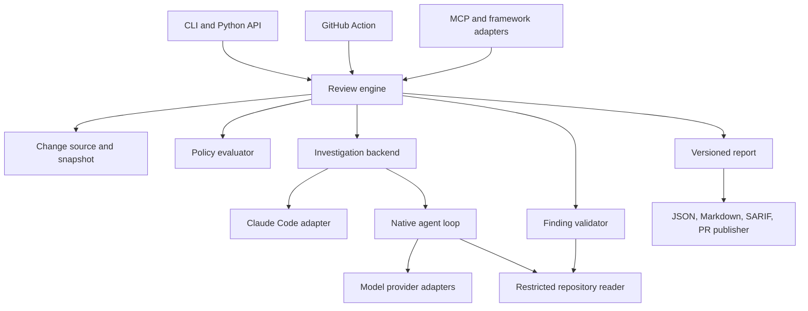

# Generic Agentic Security Reviewer: Requirements

**Status:** Draft for implementation planning  
**Version:** 0.1  
**Date:** 2026-09-15  
**Basis:** [Repository review and generic-tool assessment](generic-tool-assessment.md), based on repository commit `0c6a49f1fa56a1d472575da86a94dbc1edb78eda`  
**Working product name:** Security Review Engine

M0/M1 implementation is delivered; [implementation progress](implementation-progress.md) records acceptance evidence and outstanding external release gates. M2/M3 remain future work. This document describes the target, not a claim that all release gates have passed.

### Document navigation

- [Goals, users, and milestones](#2-goals-users-and-scope)
- [Architecture and interfaces](#3-architecture-and-ownership)
- [Review lifecycle and status](#5-workflow-status-and-coverage)
- [Security boundaries](#8-security-and-data-boundaries)
- [Configuration and budgets](#9-configuration-budgets-and-credentials)
- [Data contracts](#10-data-contracts)
- [CLI and Python API](#11-cli-and-python-api)
- [Providers, plugins, and MCP](#14-providers-plugins-and-framework-integration)
- [Verification and evaluation](#16-verification-and-detection-quality-evaluation)
- [Release gates](#17-migration-and-release-gates)
- [Pending decisions](#19-decisions-to-resolve-during-implementation-planning)

## 1. Purpose and decisions

Build a reusable security-review engine that can run as a standalone application and integrate with agentic frameworks. The engine shall investigate code changes, validate candidate vulnerabilities, apply explicit policy, and produce evidence-backed findings with trustworthy execution status.

The product shall preserve the useful workflow of the existing GitHub Action while removing mandatory dependencies on GitHub and Claude Code. It shall retain Claude Code as a compatibility backend during migration, add a native investigation backend, and expose the same engine through a Python API, CLI, GitHub Action, and optional MCP server.

### 1.1 Agreed direction

- One engine owns the review workflow, policy, report schema, and execution state.
- Model providers, investigation backends, and host integrations are separate abstractions.
- The first extraction uses the existing Claude Code investigation backend.
- A native backend later owns the model/tool loop and repository exploration.
- Framework plugins are thin adapters; they do not duplicate security-review logic.
- The existing Action is the initial functional baseline. Slash-command behavior informs later improvements but is not assumed identical.
- Reliability defects and unsafe assumptions are corrected rather than preserved as compatibility requirements.

### 1.2 Confirmed product decisions (2026-09-15)

- Native providers: configurable OpenAI API-compatible endpoints/models and Claude models through Anthropic. Model IDs are user configuration, not a fixed allowlist. Endpoint/model capabilities must still pass the required conformance checks; API compatibility alone does not guarantee tool-calling or review quality.
- Cloud processing: reviewed source may be sent to the configured cloud providers. Repository access restrictions and credential isolation still apply.
- CI finding gate: only findings with severity `HIGH` block CI by default. Other severities remain reportable. This is an explicit severity set, not an implicit threshold; execution failures remain distinct and return operational errors.

### 1.3 Normative language and release assignment

**MUST / SHALL** indicates a required, testable behavior. **SHOULD** indicates a preferred behavior for which a documented alternative is acceptable. **MAY** indicates an optional capability.

Every requirement below belongs to a milestone. A MUST applies when its assigned milestone is released; this document does not require all milestones in the first delivery. Numeric defaults and benchmark targets marked **proposed** are planning decisions, not measured product capabilities or previously approved commitments.

## 2. Goals, users, and scope

### 2.1 Product goals

1. Run local change reviews without GitHub credentials.
2. Support different investigation runtimes and model providers without changing the report contract or policy implementation.
3. Distinguish completed reviews, partial reviews, execution failures, and policy violations.
4. Produce actionable findings with source evidence and explicit validation status.
5. Make coverage, exclusions, operational errors, and resource usage visible.
6. Integrate with CI and agent frameworks through stable interfaces.
7. Establish measurable quality comparisons before claiming equivalent detection performance.

### 2.2 Primary users and journeys

| User | Journey | Successful outcome |
|---|---|---|
| Developer | Review a branch or staged changes locally | Actionable report without modifying the checkout or requiring a code-host account |
| Repository maintainer | Review each PR revision in CI | Findings tied to the correct commits, with clear scan status and no duplicate comments |
| Security engineer | Adjust review policy and inspect suppressions | Versioned, explainable policy applied consistently across entry points |
| Framework integrator | Invoke the reviewer from an existing agent | Structured job/result contract without reimplementing investigation |
| Backend developer | Add a provider or investigation runtime | Documented interfaces and reusable conformance tests |
| Evaluator | Compare backends on fixed examples | Reproducible precision, recall, coverage, runtime, and usage measurements |

### 2.3 Milestones

| Milestone | Deliverable | Primary dependency |
|---|---|---|
| M0: Reliable baseline | Correct completion semantics, safe file access, regression fixtures, explicit legacy policy | Existing implementation |
| M1: Standalone core | Installable Python package, CLI, Python API, local Git/PR sources, Claude compatibility backend, GitHub Action adapter | M0 contracts and regression cases |
| M2: Native agent | Restricted repository tools, native investigation/validation, at least two independent provider adapters, comparative evaluation | M1 engine and repository reader |
| M3: Integrations | MCP server, one framework adapter, SARIF exporter, shared command wrappers | Stable M1/M2 contracts |

M1 is a standalone product interface but may still depend on Claude Code for investigation. M2 is the milestone that removes that runtime dependency for the native backend.

### 2.4 Initial non-goals

- Automated code changes, patch application, or remediation PRs.
- Executing repository tests, builds, install scripts, or exploit demonstrations during review.
- A desktop GUI, browser dashboard, or multi-tenant hosted service.
- A marketplace or automatic download of third-party plugins.
- Universal compatibility with every framework, model, or operating environment.
- Whole-repository certification, comprehensive dependency scanning, or a replacement for all SAST tools.
- Guaranteed absence of vulnerabilities after a clean report.
- Training a model or automatically changing policy from user feedback.
- Transparent reuse of a host agent's authentication or subscription.

Whole-repository scans, remote service deployment, and sandboxed executable validation require separate requirements if added later.

## 3. Architecture and ownership



### 3.1 Boundaries

| ID | Milestone | Requirement |
|---|---|---|
| ARC-01 | M1 | The engine MUST be callable without GitHub environment variables, a CLI process, or an active framework session. |
| ARC-02 | M1 | Entry points MUST translate their inputs into the same `ReviewRequest` and consume the same `ReviewReport`. |
| ARC-03 | M1 | The core MUST NOT depend on provider-specific message classes, CLI response envelopes, or framework state types. Adapters own those translations. |
| ARC-04 | M1 | Investigation and validation backends MUST be independently configurable. A backend MAY implement both interfaces. |
| ARC-05 | M1 | Source retrieval, investigation, validation, policy, rendering, and publishing MUST have separate interfaces and test doubles. |
| ARC-06 | M1 | Only the engine MAY assign canonical run state, normalize findings, apply final policy, and construct the canonical report. Backend completion claims are inputs to validation. |
| ARC-07 | M2 | The native backend MUST run without Claude Code installed. Selecting it MUST NOT invoke the compatibility runner implicitly. |
| ARC-08 | M3 | Framework adapters MUST reuse engine policy, contracts, and status semantics. Adapter-specific presentation is allowed. |

### 3.2 Required extension contracts

- `ChangeSource.resolve(request) -> ReviewSnapshot`
- `RepositoryReader.list/read/search/diff(...) -> bounded results`
- `InvestigationBackend.investigate(context) -> InvestigationResult`
- `FindingValidator.validate(candidate, context) -> ValidationResult`
- `ModelProvider.generate(messages, tools, limits) -> normalized response`
- `PolicyEvaluator.evaluate(findings, policy) -> decisions`
- `Publisher.publish(report, target) -> PublicationResult`

Signatures are conceptual requirements, not final Python syntax. Contracts MUST define cancellation, timeouts, capability discovery, structured errors, and schema versions. Read-only operations MUST not mutate the caller's checkout. Extension capabilities MUST be checked before a run starts.

## 4. Review inputs and immutable snapshots

| ID | Milestone | Requirement |
|---|---|---|
| SRC-01 | M1 | Support local Git reviews between explicit base and head references. Resolve references to immutable commit IDs before investigation. |
| SRC-02 | M1 | Support staged changes, unstaged tracked changes, and their combined state through explicit modes. The selected mode MUST be recorded in the report. |
| SRC-03 | M1 | Untracked files MUST be excluded by default and included only by explicit configuration. Git-ignored files MUST remain excluded unless individually authorized through a trusted input. |
| SRC-04 | M1 | Freeze local working changes into an engine-owned content snapshot. Later edits to the working tree MUST NOT alter an active review. Detect changes during capture and retry within a bound or fail capture. |
| SRC-05 | M1 | Support GitHub PR inputs, including fork PRs when credentials and execution policy permit. Fetch all changed-file pages and resolve the PR's base/head commit IDs. |
| SRC-06 | M1 | All metadata, diff hunks, file reads, and finding locations MUST refer to the resolved snapshot. A mismatched checkout MUST trigger correction into an owned snapshot or an explicit error. |
| SRC-07 | M1 | Record comparison semantics: PR and branch review normally compare merge-base to head; explicit commit-to-commit comparison MUST be separately selectable. An unavailable base MUST NOT silently become an empty tree. |
| SRC-08 | M1 | Represent additions, modifications, deletions, renames, file-mode changes, and old/new paths. Support evidence from base and head revisions. |
| SRC-09 | M1 | Binary files, unsupported encodings, submodules, Git LFS pointers, oversized files, and unavailable patches MUST have explicit handling and coverage reasons. Do not automatically initialize submodules or fetch LFS content. |
| SRC-10 | M1 | Keep investigation scope separate from context access. A change-only review MAY read permitted unchanged files for context, but findings MUST explain the relationship to a selected change. |
| SRC-11 | M1 | Treat generated-file status as policy-controlled metadata. An arbitrary `@generated` string in attacker-controlled code MUST NOT automatically remove a file from scope. |
| SRC-12 | M1 | Snapshot cleanup MUST remove only resources recorded as owned by that run. It MUST NOT remove unrelated worktrees, branches, or user files. |

**Acceptance:** A fixture with more than 100 changed files produces a complete inventory. Moving a branch reference or editing a file after capture does not change the run's evidence. A removed-line finding references the base side correctly. Shallow history produces an explicit fetch requirement or resolution failure.

## 5. Workflow, status, and coverage

### 5.1 Workflow stages

The engine SHALL execute these stages with observable transitions:

1. Validate request and resolve trusted configuration.
2. Check backend capabilities, credentials, and budgets.
3. Capture or resolve the immutable snapshot.
4. Build the scope inventory and initial context.
5. Investigate code changes and collect candidates.
6. Validate candidate structure and source locations.
7. Validate candidate exploitability using the selected validation strategy.
8. Apply policy, record suppressions, and deduplicate findings.
9. Finalize the report and local artifacts.
10. Publish through a separate operation if requested.

### 5.2 Canonical run states

| State | Meaning |
|---|---|
| `queued` | Accepted for execution; work has not started |
| `running` | One or more engine stages are active |
| `completed` | Every required stage completed for the eligible scope with no unresolved coverage gap |
| `partial` | Valid analysis was produced, but required work or eligible coverage remains incomplete |
| `failed` | A valid review could not be produced because of an operational or contract failure |
| `cancelled` | Cancellation ended the run before normal completion; any accumulated findings remain available |

Allowed transitions are `queued -> running`, `queued -> cancelled/failed`, and `running -> completed/partial/failed/cancelled`. Terminal states are immutable. Retries after a terminal state create a new attempt linked to the original run. A cache hit produces a completed result with cache provenance, not a hidden state transition.

### 5.3 Policy outcome and exit codes

Policy outcome is a separate field:

- `pass`: completed review with no findings meeting the configured blocking rule.
- `fail`: one or more retained findings meet the blocking rule, including in a partial run.
- `unknown`: no known blocking finding, but completion or required validation is missing.

A report MAY contain nonblocking findings and still have `policy_outcome: pass`. Renderers MUST make those findings visible.

| Condition | CLI exit code |
|---|---:|
| Completed, policy passes, requested local artifacts written | 0 |
| Completed, policy fails | 1 |
| Invalid configuration, failed/partial execution, or required output failure | 2 |
| Cancelled | 3 |

Operational/cancellation codes take precedence over a policy failure. A requested remote publication failure returns exit code 2 for the invoking command but MUST NOT rewrite a completed scan as a failed scan. `PublicationResult` records that separate failure.

| ID | Milestone | Requirement |
|---|---|---|
| RUN-01 | M0 | Invalid, missing, or unrecognized backend output MUST NOT become a completed empty report. An error envelope remains an error even when its process exits 0. |
| RUN-02 | M0 | High-severity findings and operational failures MUST have distinct typed outcomes; evaluators MUST NOT infer success solely from exit code 0/1 or parseable JSON. |
| RUN-03 | M1 | Completion MUST require valid backend termination, required-stage completion, and reconciled coverage. A model's `review_completed` flag alone is insufficient. |
| RUN-04 | M1 | Findings produced before failure or cancellation MUST be retained with their validation status. Incomplete runs MUST never be labeled clean. |
| RUN-05 | M1 | Failed required candidate validation MUST make the run partial when other valid analysis exists, or failed when no valid analysis exists. An explicitly disabled optional validation stage is recorded as disabled rather than failed. |
| RUN-06 | M1 | Coverage MUST inventory eligible units, completed units, excluded units, and unresolved/skipped units with reasons. Each changed file/hunk MUST be accounted for exactly once at the chosen coverage granularity. |
| RUN-07 | M1 | Reading a file MUST NOT itself count as completing its review. Completion requires an investigation result for the assigned scope unit; coverage describes process execution, not proof of vulnerability absence. |
| RUN-08 | M1 | Policy-approved exclusions may coexist with `completed`; unexpected truncation, unsupported eligible files, missing data, and exhausted required work MUST produce `partial` or `failed`. |
| RUN-09 | M1 | Stage transitions and terminal state MUST remain inspectable without parsing free-form logs. |

## 6. Investigation and validation

### 6.1 Claude Code compatibility backend

| ID | Milestone | Requirement |
|---|---|---|
| COMP-01 | M1 | Preserve the existing investigation workflow behind an `InvestigationBackend` adapter and document intentional behavioral corrections. |
| COMP-02 | M1 | Normalize CLI output envelopes and reject CLI errors, incomplete execution, invalid report structures, and unsupported output formats. Bounded repair MUST NOT discard error indicators. |
| COMP-03 | M1 | Pass model and timeout settings explicitly. Version/authentication checks MUST validate the configured execution path; they MUST NOT require access to an unrelated hardcoded model. |
| COMP-04 | M1 | Declare platform, isolation, usage-reporting, cancellation, and context-management capabilities. Unsupported capabilities MUST fail preflight when required. |
| COMP-05 | M1 | Retain trusted-input restrictions unless the selected runtime's enforced isolation passes the untrusted-input acceptance tests. |

### 6.2 Native investigation backend

| ID | Milestone | Requirement |
|---|---|---|
| AGT-01 | M2 | Implement an explicit iterative model/tool loop that can inspect unchanged code and trace cross-file data flow relevant to a selected change. |
| AGT-02 | M2 | Supply narrow tools for file inventory, bounded file reads, text search, diff retrieval, and base/head revision reads. No general shell or write tool is part of the baseline native backend. |
| AGT-03 | M2 | Every tool request MUST be validated and executed by the repository service. Model-generated arguments MUST NOT become shell commands or unrestricted filesystem paths. |
| AGT-04 | M2 | Manage context using bounded chunks, continuation cursors, and explicit truncation metadata. Preserve access to change information when the initial diff exceeds context capacity. |
| AGT-05 | M2 | Validate model output against a versioned candidate schema. Schema repair MAY occur within a configured limit; failure MUST remain visible. |
| AGT-06 | M2 | Stop on completion, cancellation, deadline, tool/turn/token limit, or provider failure. A bounded repeated-tool-call/no-progress detector MUST prevent indefinite loops. |
| AGT-07 | M2 | Record the evidence references supporting candidates and distinguish observed code facts from assumptions or unverified exploit conditions. |

### 6.3 Candidate validation

| ID | Milestone | Requirement |
|---|---|---|
| VAL-01 | M0 | Validation failures MUST NOT assign maximum confidence or silently assert that a candidate is confirmed. |
| VAL-02 | M1 | Validate paths, revisions, line ranges, severity values, confidence bounds, and required fields before reading finding-referenced files or publishing findings. |
| VAL-03 | M1 | Every candidate MUST end as `confirmed`, `rejected`, `uncertain`, or `unvalidated`, with a reason and validator provenance. Policy suppression is separate from validation status. |
| VAL-04 | M1 | Use one confidence scale: 0.0 through 1.0, or null when unknown. Confidence MUST NOT be presented as a calibrated probability unless separately demonstrated. |
| VAL-05 | M1 | Candidate validation MUST assess the stated attack path, relevant controls, impact, preconditions, and relationship to newly introduced changes. |
| VAL-06 | M2 | Native validation MUST use a fresh context and restricted repository access, allowing it to inspect callers, callees, guards, and base/head differences beyond the reported file. |
| VAL-07 | M2 | Validation concurrency MUST be configurable and bounded by the same run budget. A validator error MUST NOT discard unrelated validated findings. |
| VAL-08 | M1 | Retain rejected, uncertain, and policy-suppressed candidates in the report or a referenced local detail artifact so filtering decisions are auditable. |

## 7. Policy requirements

| ID | Milestone | Requirement |
|---|---|---|
| POL-01 | M0 | Extract legacy exclusions into an explicit versioned compatibility profile. Corrections to unsafe or invalid rules MUST be documented rather than hidden. |
| POL-02 | M1 | Provide an explicit default policy profile and record its name, version, effective configuration hash, and trusted source in each report. |
| POL-03 | M1 | Distinguish scope exclusions, confirmed false positives, accepted-risk suppressions, uncertain findings, and findings below the configured reporting threshold. |
| POL-04 | M1 | Make category scope, severity threshold, confidence threshold, directory scope, validation requirement, and suppression rules configurable through structured settings. |
| POL-05 | M1 | Custom instructions MUST NOT be advertised as overriding structured exclusions unless they actually do. Provide explicit replace/extend semantics for prompt additions and policy rules. |
| POL-06 | M1 | No language or filename heuristic may categorically assert that memory vulnerabilities are impossible. Unsafe code, native dependencies, FFI, and C/C++ extension variants MUST be considered by evidence. |
| POL-07 | M1 | Broad text matches MUST NOT suppress an entire mixed-impact finding solely because its description mentions an excluded category. |
| POL-08 | M1 | Apply severity and numeric confidence thresholds deterministically in engine code, not solely through prompt instructions or model `keep_finding` fields. |
| POL-09 | M1 | Suppression records MUST identify the rule, reason, source, and matched finding. User-authored suppressions SHOULD support owner and expiry metadata. |
| POL-10 | M1 | Security scope exclusions MUST NOT be treated as confidentiality controls. Files prohibited from provider transmission require separate access restrictions. |

**Proposed default profile:** investigate concrete newly introduced vulnerabilities across language boundaries; do not automatically suppress categories merely to match legacy alert volume; require validation for blocking findings; report HIGH/MEDIUM confirmed findings with confidence at least 0.8; keep other candidates in detail artifacts. Category choices and blocking threshold remain explicit configuration, with the legacy profile available for comparisons.

## 8. Security and data boundaries

### 8.1 Threat model

The engine processes potentially hostile source text, filenames, symlinks, PR titles/descriptions, tool-result content, and model output. These may attempt to alter review policy, read unrelated files, trigger command execution, disclose secrets, or corrupt reports. Installed backend/plugin code and the selected model service are separate trust dependencies; this product does not make an untrusted plugin safe merely by defining an interface.

The baseline review is read-only. A clean report is not a security certificate. Prompt-injection controls aim to enforce access and execution boundaries; they do not establish immunity to manipulated reasoning.

| ID | Milestone | Requirement |
|---|---|---|
| SEC-01 | M0 | Confine all engine-controlled source reads to approved snapshots. Reject traversal, absolute paths, UNC/device paths, symlink/junction escapes, and nonregular files unless a separately defined safe representation exists. |
| SEC-02 | M1 | Prefer immutable Git blob or owned-snapshot reads. Resolve containment safely at access time; checking a mutable path once before reading is insufficient. |
| SEC-03 | M1 | Treat repository instructions, hooks, configuration, and PR content as untrusted data. They MUST NOT automatically authorize tools, load plugins, change credentials/endpoints, or weaken trusted policy. |
| SEC-04 | M1 | Configuration and policy used for a PR review MUST originate from explicit trusted inputs, a trusted base revision, or an administrator-controlled location. A PR changing policy MUST NOT silently change its own review rules. |
| SEC-05 | M1 | Separate source-acquisition credentials, model credentials, and publishing credentials. Investigation runtimes MUST NOT inherit unrelated secrets or the publishing token. |
| SEC-06 | M2 | Native model access MUST occur through provider adapters; repository tools MUST have no arbitrary outbound network capability. Untrusted content cannot select a provider endpoint or arbitrary URL fetch. |
| SEC-07 | M1 | Git acquisition MUST avoid external diff drivers, text-conversion filters, hooks, automatic submodule initialization, and repository-controlled executable helpers. Fetch operations require explicit time/resource bounds. |
| SEC-08 | M1 | Enforce file-read, search, diff, and tool-response limits before transmitting content to a provider. Credential-bearing local files outside allowed context MUST not be loaded as incidental context. |
| SEC-09 | M1 | The product MUST document which providers receive source content. A setting that forbids external transmission MUST reject incompatible provider/backend choices; it cannot silently fall back to a cloud provider. |
| SEC-10 | M1 | Logs MUST redact known credentials and avoid raw prompts/source content by default. Diagnostic transcripts require explicit trusted configuration and access-controlled storage. |
| SEC-11 | M1 | Sanitize rendered findings so hostile paths, Markdown, control characters, or workflow-command syntax cannot create unintended commands or misleading report structure. Raw evidence remains available through a safely encoded representation. |
| SEC-12 | M1 | Access checks MUST precede candidate file reads and filtering API calls, even when a finding will later be excluded from the final report. |
| SEC-13 | M2 | An advertised untrusted-input mode MUST fail closed when the chosen backend cannot enforce its declared filesystem, execution, credential, and network restrictions. Native tool limits alone do not sandbox a separate unrestricted CLI. |
| SEC-14 | M1 | Review execution MUST not modify tracked source, the index, branches, user Git configuration, or unrelated worktrees. Run artifacts belong in a configured output/cache location. |

**Acceptance:** Use synthetic secrets and adversarial fixtures. Attempts to read parent paths, Windows alternate path forms, external symlinks, repository-provided endpoint changes, and prompt-requested shell execution must be rejected without exposing fixture secrets. Verify the compatibility backend separately from native tools; no backend inherits another backend's security claim.

## 9. Configuration, budgets, and credentials

### 9.1 Configuration resolution

Trusted policy constraints are applied first and cannot be weakened by lower-trust settings. Within permitted settings, use this precedence: explicit API/CLI input, approved environment variables, explicitly selected trusted configuration file, packaged defaults.

Relative paths in a config file resolve against that file's directory; CLI paths resolve against the invocation directory. Repository-relative instruction paths MUST be an explicit path type or resolve against the declared repository root. Entry points MUST NOT depend on an incidental `chdir` into the Action installation.

| ID | Milestone | Requirement |
|---|---|---|
| CFG-01 | M1 | Parse and validate configuration once before execution. Reject unknown keys, invalid values, missing requested instruction files, and contradictory modes with actionable errors. |
| CFG-02 | M1 | Support independent investigation and validation backend/provider/model selections, with no silent provider/model substitution. |
| CFG-03 | M1 | Permit secret references through environment variables or adapter-specific credential stores. Resolved secrets MUST NOT appear in effective-config output, report hashes, or report bodies. |
| CFG-04 | M1 | Expose a redacted effective configuration command or API including source provenance and defaults. |
| CFG-05 | M1 | All network and subprocess operations MUST have finite timeouts. A run-wide deadline covers acquisition, investigation, validation, retries, and finalization; publication has a separate bounded budget. |
| CFG-06 | M2 | Enforce limits for model turns, tool calls, tool-output bytes, candidate count, validation concurrency, and provider usage. Limits MUST be visible in partial-result reasons. |
| CFG-07 | M1 | Classify retryable transient failures separately from authentication, unsupported-model, invalid-input, and permission failures. Retries MUST remain within the original deadline. |
| CFG-08 | M2 | If a monetary ceiling is requested, cost capability and pricing provenance MUST be declared. Unsupported exact accounting MUST be rejected or explicitly treated as an estimate with a documented overshoot bound. |

### 9.2 Proposed initial operational defaults

These defaults require validation against the benchmark before release; they are not throughput promises.

| Setting | Proposed value | Required behavior |
|---|---:|---|
| End-to-end review deadline | 20 minutes | Include validation and retries; return partial/failed rather than clean on exhaustion |
| Per external request limit | 180 seconds | Clip to remaining run time |
| Transient retry count | 2 retries | Bounded exponential backoff with jitter; honor provider retry hints within deadline |
| Schema repair attempts | 1 | Preserve initial invalid output as a sanitized diagnostic |
| Native model turns | 60 | Stop with a visible budget reason |
| Native tool calls | 200 | Count across investigation and validation |
| Individual tool response | 64 KiB | Return continuation/truncation metadata |
| Individual source-file eligibility limit | 1 MiB | Oversized eligible files create visible coverage gaps unless handled by chunking |
| Validation concurrency | 1 initially | Higher values require explicit configuration and shared-budget accounting |

Token limits must be provider-capability aware. A budget is enforced before starting additional work and through request output limits where supported; already in-flight provider usage cannot always be cancelled retroactively.

## 10. Data contracts

Published schemas MUST be machine-readable and versioned. Model outputs and adapter results MUST be validated before they become canonical engine objects. Unknown enum values, invalid confidence scores, noninteger line numbers, and missing required fields are contract errors.

### 10.1 `ReviewRequest`

| Field | Requirement |
|---|---|
| `schema_version` | Version of the public request contract |
| `source` | Local repository or code-host locator with explicit comparison mode |
| `scope` | Base/head references or working-tree mode, include/exclude rules, untracked-file choice |
| `policy` | Profile, version, approved overrides, trusted instruction references |
| `investigation` / `validation` | Backend/provider/model identifiers and supported options |
| `limits` | Deadline, retries, tool/turn limits, usage budget, concurrency |
| `data_access` | Approved roots/snapshot access, content restrictions, provider-transmission constraints |
| `output` | Requested local formats and destinations; publishing is separately configured |
| `idempotency_key` | Optional caller key scoped to an immutable resolved request |

### 10.2 `ReviewSnapshot`

Required fields: stable snapshot ID, source type, sanitized repository identity, base/head commit IDs where applicable, merge-base/comparison mode, working-copy content hash where applicable, capture timestamp, complete changed-file inventory, and per-file old/new paths and content identities. Do not embed access tokens in source URLs.

### 10.3 `Finding`

| Field | Requirement |
|---|---|
| `id` / `fingerprint` | Run-local ID plus versioned stable identity for deduplication |
| `title` / `description` | Concise issue statement and evidence-based explanation |
| `severity` | `critical`, `high`, `medium`, or `low`; legacy values mapped explicitly |
| `category` | Stable vulnerability category; optional CWE mapping |
| `locations` | Repository-relative path, base/head side, revision/content ID, integer line range |
| `evidence` | Bounded supporting excerpts or immutable references, with source/sink/control details when applicable |
| `introduced_by` | Relevant changed hunk(s) and explanation of newly introduced impact |
| `exploit_scenario` / `preconditions` | Plausible attack path and explicit assumptions |
| `recommendation` | Actionable remediation guidance without automatic modification |
| `validation_status` | `confirmed`, `rejected`, `uncertain`, or `unvalidated` |
| `confidence` | Number in [0,1] or null; provenance and reasoning recorded separately |
| `policy_decision` | `retained`, `suppressed`, or `out_of_scope`, with rule/reason references |
| `provenance` | Investigation/validation backend and model identifiers |

The engine MUST preserve original candidate identity through validation, suppression, and deduplication. Fingerprints MUST not depend solely on line number or model wording; the algorithm and rename/rebase limitations must be documented.

### 10.4 `ReviewReport`

Required fields:

- `schema_version`, `run_id`, attempt lineage, timestamps, and duration.
- `status`, `policy_outcome`, current/last stage, and typed errors/warnings.
- Snapshot identity and comparison semantics.
- Effective nonsecret configuration/policy hash and engine/backend/provider versions.
- Retained findings and referenced or embedded candidate/suppression details.
- Coverage inventory and counts with skip/truncation reasons.
- Stage-level runtime, provider usage, retry counts, and cost estimate when available.
- Cache provenance and source run ID when reused.
- References to generated local artifacts.

Unknown usage is null/unsupported, never zero. Self-reported model coverage and host-observed tool activity MUST remain distinguishable. The canonical report MUST not contain credentials or unrestricted raw agent transcripts.

### 10.5 `PublicationResult` and errors

`PublicationResult` records target, report/snapshot identity, status, created/updated/skipped item identifiers, and errors. Publication can be retried without rerunning the scan.

Errors MUST include a stable code, stage, sanitized message, retryability, and optional backend detail. Initial code families SHALL cover configuration, source resolution, permissions, backend availability/authentication, rate limiting, timeout, cancellation, context/usage limits, invalid output, incomplete coverage, artifact writing, and publication failure.

## 11. CLI and Python API

The executable name below is provisional. Examples describe required behavior, not commands already implemented.

```text
security-review scan --repo . --base main --head HEAD --format json --output review.json
security-review scan --repo . --staged --format markdown --output review.md
security-review scan --repo . --working-tree --include-untracked --output review.json
security-review scan --pr owner/repo#123 --config ./trusted-review.toml --output review.json
security-review publish --report review.json --pr owner/repo#123
security-review config show --redact
security-review backends list
```

| ID | Milestone | Requirement |
|---|---|---|
| CLI-01 | M1 | Provide explicit local revision, staged, working-tree, and PR review modes. Invalid combinations MUST fail before network/model calls. |
| CLI-02 | M1 | JSON output to stdout MUST contain one valid machine-readable document; logs and progress go to stderr. File output MUST be written atomically where the platform supports it. |
| CLI-03 | M1 | Support JSON and Markdown reports. Renderers MUST show completion, coverage gaps, unvalidated findings, and policy outcome. |
| CLI-04 | M1 | Apply the exit-code contract in section 5.3 and document advisory use in CI. |
| CLI-05 | M1 | Support interruption/cancellation, terminate owned subprocesses, and finalize an available partial/cancelled report without touching unrelated processes. |
| API-01 | M1 | Expose typed request/result objects, a cancellable review operation, and structured progress events. The library MUST NOT call `sys.exit`, modify global cwd, or mutate process environment as an API side effect. |
| API-02 | M1 | Allow test injection of providers, source readers, clocks, and publishers without requiring live accounts. |
| API-03 | M1 | Provide a documented public API/version policy. Internal modules and provider SDK objects MUST NOT be required by integrations. |

M1 local scans MUST work without GitHub tokens or `gh`. The Claude backend may require its own runtime and authentication; those requirements must be shown by backend capability/preflight output.

## 12. GitHub integration and reporting

| ID | Milestone | Requirement |
|---|---|---|
| GH-01 | M1 | Make the GitHub Action a wrapper over the same engine used by the CLI. Backend, model, policy, timeout, and instruction settings MUST reach the effective request. |
| GH-02 | M1 | Output `scan-status`, `policy-outcome`, `findings-count`, `results-file`, and `publication-status` when relevant. Result paths MUST exist and be consumable from the caller's workspace. |
| GH-03 | M1 | Advisory mode MAY leave the workflow successful, but MUST expose incomplete/failed status. Blocking mode MUST fail on configured finding thresholds and operational failures. |
| GH-04 | M1 | Review each new head revision by default. Legacy once-per-PR behavior MAY be retained only as an explicit documented option. |
| GH-05 | M1 | Paginate changed files, existing comments, and other result sets used for reporting. |
| GH-06 | M1 | Map validated locations to diff sides and line ranges. Findings that cannot be posted inline MUST appear in a summary rather than disappear. |
| GH-07 | M1 | Deduplicate per finding and revision using stable metadata. Existing comments MUST NOT suppress unrelated new findings. |
| GH-08 | M1 | Check the PR's current head before publication. If it differs from the reviewed head, report stale publication status and avoid presenting findings as a review of the new revision. |
| GH-09 | M1 | Update only comments owned by this tool. A finding may be marked resolved only after a completed, comparable subsequent review; partial reviews cannot establish resolution by absence. |
| GH-10 | M1 | Support independent retries of failed publication without paying for another investigation. |
| GH-11 | M1 | Document minimal read/publish permissions and explicit behavior for forks, missing secrets, unavailable permissions, and non-PR triggers. Do not introduce unsafe elevated PR execution as a workaround. |
| REP-01 | M3 | Export the canonical report to SARIF with validated locations, stable rule identifiers, and fingerprints. Incomplete execution MUST remain visible in exporter-supported run diagnostics. |

The initial Action migration SHOULD retain old input names as deprecated aliases where unambiguous. Conflicting old/new settings MUST produce a validation error. Release notes must enumerate default changes such as per-commit scanning and corrected failure semantics.

## 13. Caching, concurrency, and job ownership

| ID | Milestone | Requirement |
|---|---|---|
| JOB-01 | M1 | Cache only valid completed reports for normal result reuse. Failed, partial, cancelled, or reserved runs MUST NOT prevent a fresh attempt. |
| JOB-02 | M1 | Cache identity MUST include content/snapshot identity, comparison scope, policy/instruction hash, engine/backend/provider/model versions, relevant generation settings, and data-access constraints. Secret values MUST NOT be included. |
| JOB-03 | M1 | Concurrency control MUST use atomic local locking or host-supported coordination. A cached reservation marker alone is not a lock. |
| JOB-04 | M1 | Locks MUST identify owner/run and support safe stale-owner recovery. Cleanup MUST verify ownership and containment. |
| JOB-05 | M1 | Cache reuse MUST be explicit in reports, preserve original provenance, and support bypass. It MUST NOT be described as a newly executed investigation. |
| JOB-06 | M3 | An idempotency key reused with different resolved inputs MUST be rejected. Result/status retrieval and cancellation MUST operate only on caller-accessible jobs. |
| JOB-07 | M3 | A server restart MUST not leave persisted jobs permanently reporting `running`. Interrupted jobs become failed/partial with a restart reason; automatic resumption is optional. |

Caches and artifacts require documented retention and a scoped cleanup operation. Multi-user shared caches are out of initial scope; implementations MUST not assume a cache can be shared safely across trust boundaries.

## 14. Providers, plugins, and framework integration

### 14.1 Provider and backend capabilities

| ID | Milestone | Requirement |
|---|---|---|
| EXT-01 | M1 | Provide an explicit registry of source, backend, validation, policy, and publisher adapters. Load only configured installed extensions. |
| EXT-02 | M2 | Provider adapters MUST normalize text/tool-call responses, stop reasons, usage, rate-limit/authentication errors, and cancellation behavior. |
| EXT-03 | M2 | Declare tool-calling, structured-output, context-limit, usage-accounting, and endpoint capabilities. Missing required capabilities MUST fail preflight. |
| EXT-04 | M2 | Ship and evaluate at least two independently implemented provider adapters. Changing provider must not require changing core policy, repository tools, or report schema. |
| EXT-05 | M2 | A generic API-compatible endpoint MAY be supported, but each declared compatibility profile MUST pass conformance tests. Protocol resemblance is not evidence of equivalent model capability. |
| EXT-06 | M3 | Extensions MUST declare interface version and capabilities. Reject incompatible extensions with an actionable error; do not discover executable plugins from the reviewed checkout. |
| EXT-07 | M3 | Publish a backend/framework/platform compatibility matrix and a reusable conformance suite. No blanket “works with any framework” claim is permitted without defined prerequisites. |

A plugin is trusted executable code unless isolated in a separately specified process/service. A provider abstraction does not normalize model quality or make all model capabilities interchangeable.

### 14.2 MCP and framework adapter

M3 SHALL expose engine-owned execution through a local MCP server. Proposed tools:

| Tool | Input | Result |
|---|---|---|
| `start_review` | Validated review request and optional idempotency key | Run ID and initial state |
| `get_review_status` | Run ID | State, stage, bounded progress, usage summary |
| `get_review_result` | Run ID | Canonical report or a clear not-ready result; bounded artifact references as needed |
| `cancel_review` | Run ID | Idempotent cancellation acknowledgement/current terminal state |

| ID | Milestone | Requirement |
|---|---|---|
| MCP-01 | M3 | Publish explicit input/output schemas and structured results. Protocol/tool errors and unsuccessful review outcomes MUST remain distinguishable. |
| MCP-02 | M3 | Long reviews MUST not require one indefinitely open tool call. Polling, cancellation, and bounded result retrieval MUST work with the supported client set. |
| MCP-03 | M3 | Restrict local requests to configured roots and trusted settings. Model-supplied tool arguments MUST NOT change credentials, load plugins, or grant broader access. |
| MCP-04 | M3 | The host's model authentication MUST NOT be assumed available to the engine. Missing engine credentials/backend access must produce an explicit setup error. |
| MCP-05 | M3 | Scan tools MUST NOT publish externally as an implicit side effect. Publication requires a separately configured and invoked operation. |
| MCP-06 | M3 | At least one framework adapter MUST invoke this engine contract and pass the same request/result/status tests as the CLI. |

Host-owned investigation through prompts/skills MAY be provided later as a separate execution mode. It MUST disclose host-dependent behavior and pass its own evaluations before claiming parity. Remote MCP serving requires additional authentication, authorization, tenant isolation, and repository-upload requirements; it is not part of M3's local server scope.

## 15. Nonfunctional requirements

| ID | Milestone | Requirement and verification |
|---|---|---|
| NFR-01 | M1 | Package as an installable Python distribution with console entry point and optional adapter dependencies. A minimal installation MUST not import unavailable optional SDKs. Test clean-environment installation. |
| NFR-02 | M1 | CLI/core behavior MUST be tested on Windows, Linux, and macOS for declared Python versions. Backend-specific limitations must be explicit. Select the supported Python range before M1 release. |
| NFR-03 | M1 | Production release dependencies and external runtime versions MUST be reproducible or constrained by a tested compatibility range. Do not install an unqualified latest runtime in a production release path. |
| NFR-04 | M1 | Repository/model processing MUST use bounded memory inputs. File inventories and diff handling must support paging/chunking rather than requiring unlimited whole-repository prompts. |
| NFR-05 | M1 | Emit structured stage/usage/error events and concise human progress. Provider request IDs MAY be recorded after sanitization; raw source is opt-in diagnostics. |
| NFR-06 | M2 | Enforce cancellation without dispatching new provider/tool work once acknowledged. Proposed local cleanup target: 10 seconds, excluding provider-side work that cannot be revoked; document that limitation. |
| NFR-07 | M1 | Persist valid reports atomically where supported. Interrupted writes MUST not leave a malformed report presented as a successful artifact. |
| NFR-08 | M1 | Unit and contract tests MUST run offline without credentials or home-directory mutations. Live provider tests must be explicitly selected and budgeted. |
| NFR-09 | M1 | Maintain API/schema versioning, migration notes, an operational troubleshooting guide, and examples that are validated against the released interface. |
| NFR-10 | M1 | Retain upstream notices and maintain dependency/license metadata suitable for redistribution. |

No fixed reviews-per-minute service SLA is defined for a local application whose runtime depends on repository size and provider response time. Benchmarks SHALL report latency by workload class, model, and provider, including tail latency and failure rate.

## 16. Verification and detection-quality evaluation

### 16.1 Test layers

1. **Unit tests:** contracts, configuration, policy, path confinement, diff mapping, fingerprints, and state transitions.
2. **Offline contract tests:** backend envelopes, provider tool calls, retries, malformed results, cancellation, and capability negotiation.
3. **Offline integration tests:** frozen repositories through engine, CLI, Action wrapper, publishers, and framework adapters.
4. **Adversarial boundary tests:** hostile filenames/content, path escapes, unauthorized config changes, inherited credentials, output injection, and resource exhaustion.
5. **Live quality evaluations:** fixed repositories and labeled findings using explicitly selected models, policies, and budgets.

Recorded model responses can prove contract compatibility; they cannot prove a new model's detection quality. Live evaluations must preserve original reports and suppression decisions for adjudication.

### 16.2 Acceptance scenarios

| ID | Scenario | Required result | Key requirements |
|---|---|---|---|
| AT-01 | CLI wrapper contains prose instead of a findings report | Failed/partial with invalid-output reason; never completed clean | RUN-01, COMP-02 |
| AT-02 | Evaluator receives parseable `error` JSON with exit code 1 | Count as execution failure, not a successful negative case | RUN-02 |
| AT-03 | Finding references `../outside`, an absolute path, UNC path, or external symlink | Reject before any content transmission | SEC-01, SEC-12 |
| AT-04 | Same memory issue appears in `.cpp`, `.cxx`, `.hpp`, and unsafe Rust/FFI fixtures | No categorical false-positive suppression by extension/language | POL-06 |
| AT-05 | PR has 250 files and findings after file 100 | Complete inventory; findings eligible for inline/summary publication | SRC-05, GH-05 |
| AT-06 | A later PR commit adds a distinct vulnerability after a prior bot comment | New scan and new finding publication without blanket suppression | GH-04, GH-07 |
| AT-07 | Previous run reserved a slot then failed | New attempt can run; no completed-result cache hit | JOB-01, JOB-03 |
| AT-08 | Relative instruction path used from an installed Action directory | Resolve against documented source; missing path is an error | CFG-01, GH-01 |
| AT-09 | PR advances during scan | Evidence remains on original snapshot; publication marked stale | SRC-06, GH-08 |
| AT-10 | Diff or provider context limit is exceeded | Retrieve chunks or report explicit incomplete coverage | AGT-04, RUN-08 |
| AT-11 | Validator times out after some confirmations | Retain confirmations; unresolved candidates unvalidated; run partial | VAL-01, RUN-05 |
| AT-12 | Source asks agent to change policy, read credentials, or run shell | No expanded access, policy change, or shell execution | SEC-03, SEC-05, AGT-02 |
| AT-13 | User cancels during native validation | No new work; owned resources cleaned; cancelled report available | CLI-05, NFR-06 |
| AT-14 | Publishing fails after a completed scan | Scan report preserved; publication failure retryable independently | GH-10 |
| AT-15 | Backend says complete but omits assigned eligible files | Reconciliation yields partial/failed | RUN-03, RUN-06 |
| AT-16 | Working tree changes during or after capture | Stable snapshot or explicit capture failure; no mixed evidence | SRC-04 |
| AT-17 | Same request reaches CLI, Python API, Action, and framework adapter using recorded backend responses | Same normalized findings, policy, and status; presentation may differ | ARC-02, MCP-06 |
| AT-18 | Optional SDK absent and another backend selected | Core imports and selected backend work | NFR-01 |

These tests are mandatory at the milestone that implements the affected surface. CI tests must not require production secrets or public comment creation.

### 16.3 Labeled benchmark requirements

| ID | Milestone | Requirement |
|---|---|---|
| EVAL-01 | M0 | Record the existing baseline and known defects. Separate legacy behavior preservation from intentional corrections. |
| EVAL-02 | M1 | An evaluation case MUST pin repository/base/head, policy, expected vulnerabilities, negative expectations, and acceptable evidence locations. |
| EVAL-03 | M2 | Measure candidate discovery and final validated results separately: precision, recall, severity/category breakdown, location accuracy, duplicate rate, coverage/completion, latency, usage, and cost where known. |
| EVAL-04 | M2 | Include negative cases, preexisting vulnerabilities, multi-file authorization, injection, unsafe Rust/FFI, large diffs, renames/deletions, framework-specific controls, and adversarial source instructions. |
| EVAL-05 | M2 | Use a held-out set not used to tune prompts/policies. Human adjudication MUST resolve ambiguous matches and model-discovered findings absent from initial labels. |
| EVAL-06 | M2 | Repeat nondeterministic runs and report variation and sample sizes. Execution failures MUST remain in completion metrics and must not be dropped to improve quality figures. |
| EVAL-07 | M2 | Compare providers under the same policy, scope, and documented budget. Unsupported categories/capabilities must be disclosed rather than silently removed from one backend's denominator. |
| EVAL-08 | M2 | A release claiming parity MUST publish its benchmark manifest, aggregate metrics, limitations, and threshold decision. Unit-test pass counts are not parity evidence. |

**Proposed pilot benchmark:** at least 80 pinned changes, including at least 40 with labeled vulnerabilities and 40 negatives, spanning multiple languages and repository structures; at least three runs per backend configuration. This is an initial comparison corpus, not proof of broad production accuracy.

**Proposed M2 decision targets:** final finding precision at least 90%, labeled vulnerability recall at least 80%, and neither metric more than five percentage points below the corrected compatibility baseline on the same held-out set; completed-run rate at least 95%; no unresolved critical access-boundary regressions. Runtime and usage/cost must be reported, with target budgets set after baseline measurement.

These targets are provisional. The product owner and security evaluator must finalize the corpus, matching rules, uncertainty reporting, and acceptance thresholds before backend tuning. If the baseline or new backend misses an absolute target, the release must disclose experimental status rather than claim equivalent production quality. Report both completed-run quality and end-to-end performance including incomplete runs.

## 17. Migration and release gates

### M0: Reliable baseline

Required outcomes:

- Fix false-clean and evaluator-success defects.
- Confine finding-referenced file access and add synthetic security regressions.
- Document the existing Action/slash-command differences and freeze compatibility fixtures.
- Extract explicit policy assumptions and correct known extension/language errors.
- Make current tests isolate cwd and temporary resources; eliminate home-directory writes in offline tests.

**Gate:** all applicable offline regressions pass; malformed/error outputs cannot be clean results; the baseline evaluation distinguishes failures, findings, and completed negatives.

### M1: Standalone core

Required outcomes:

- Public request/report/status contracts and Python packaging.
- Local revision/staged/working-tree review, GitHub source adapter, Claude compatibility backend, and validation adapter.
- JSON/Markdown CLI and Python API using the same engine.
- Trusted configuration, immutable snapshots, corrected policy, budgets, cache ownership, and GitHub publishing.
- Migration guide, deprecated input aliases, backend/platform capability matrix, and offline conformance suite.

**Gate:** local scans require no GitHub account; configuration/output paths work from arbitrary invocation directories; exact recorded fixtures yield consistent reports across entry points; Linux/Windows/macOS core tests pass; any compatibility-backend security limitations are explicit.

### M2: Native agent and provider independence

Required outcomes:

- Native restricted tool loop, cross-file investigation, bounded context management, and fresh-context validation.
- Two independent provider adapters and shared provider conformance tests.
- Deadline/cancellation/usage enforcement and adversarial boundary tests.
- Held-out live evaluation against the corrected baseline.

**Gate:** native scans work with Claude Code absent; changing provider does not change core policy/contracts; mandatory boundary tests pass; quality targets are met or the backend is clearly released as experimental without a parity claim.

### M3: Integrations

Required outcomes:

- Local MCP job/result interface and one framework adapter.
- SARIF exporter and documented supported client/framework versions.
- Shared-engine command wrappers to replace duplicated prompt-only integrations where feasible.

**Gate:** adapters pass the same status/report conformance tests; long jobs can be queried and cancelled; report size is bounded through artifact retrieval; publication remains separate from scan invocation.

No delivery dates are specified. Estimation follows decomposition of these milestones and baseline runtime/quality measurements.

## 18. Traceability to repository findings

| Assessment finding | Requirements addressing it |
|---|---|
| Malformed result becomes a successful empty report | RUN-01 through RUN-04, COMP-02, AT-01 |
| Evaluator accepts operational errors as successful reviews | RUN-02, EVAL-01 through EVAL-08, AT-02 |
| Finding path escapes repository | VAL-02, SEC-01/02/12, AT-03 |
| Host execution and credential isolation are undefined | SEC-03 through SEC-09, SEC-13, COMP-04/05 |
| Overbroad exclusions and unsafe language assumptions | POL-01 through POL-10, AT-04 |
| Cached reservation suppresses retries | JOB-01 through JOB-05, AT-07 |
| Existing comments suppress all later findings | GH-04, GH-07, GH-09, AT-06 |
| Missing pagination and invalid inline locations | SRC-05, SRC-08, GH-05/06, AT-05 |
| Timeout and custom instruction settings do not reach implementation | CFG-01/04/05, COMP-03, GH-01, AT-08 |
| Failure or disabled validation receives maximum confidence | VAL-01/03/04, RUN-05, AT-11 |
| Live PR metadata and checkout can diverge | SRC-01/04/06/07, GH-08, AT-09/16 |
| Large-diff fallback loses change context | AGT-04, RUN-06/08, AT-10/15 |
| Monolithic environment-driven entry point and duplicated workflows | ARC-01 through ARC-08, API-01 through API-03 |
| Destructive worktree cleanup and platform-sensitive tests | SRC-12, JOB-04, NFR-02/08, M0 gate |

## 19. Decisions to resolve during implementation planning

This register records resolved implementation choices alongside decisions still needed for later releases.

| ID | Decision | Proposed position | Needed before |
|---|---|---|---|
| DEC-01 | Package/executable name | Implemented distribution `security-review-engine`, executable `security-review`; public registry availability remains unverified | Public package publication |
| DEC-02 | Supported Python versions | Selected Python 3.11–3.14; Windows/Linux/macOS matrix configured, Windows 3.13 verified locally | Full matrix before M1 release |
| DEC-03 | Default policy and blocking threshold | Decided: HIGH findings only block CI; reporting and confidence policy remain explicit | Confirmed 2026-09-15 |
| DEC-04 | First two native providers and model configurations | Decided: OpenAI API-compatible endpoints and Claude; configurable model IDs, capabilities verified per endpoint/model | Confirmed 2026-09-15 |
| DEC-05 | Exact benchmark corpus and quality thresholds | Adopt section 16 proposals as planning targets, finalize before tuning | M2 evaluation |
| DEC-06 | Required untrusted-input environments | Native restricted tools first; compatibility backend retains limitations until separately verified | Any untrusted-input support claim |
| DEC-07 | First framework and MCP client set | Select one actual consumer and test end to end | M3 acceptance planning |
| DEC-08 | Artifact/cache retention defaults | Implemented opt-in local SQLite storage, explicit inspection and scoped cleanup; cleanup defaults to 30 days, no automatic deletion or telemetry | Resolved for M1 |
| DEC-09 | Investigation orchestration implementation | Start with a small explicit state machine; keep runtime choice internal | M2 design |
| DEC-10 | Remote hosting or multi-user access | Separate future scope, with its own access-control and isolation requirements | Any hosted deployment project |

## 20. Definition of done

A milestone is complete when its MUST requirements and acceptance scenarios are satisfied, public behavior is documented, migrations and limitations are explicit, applicable offline tests pass, and live evaluation evidence is supplied for quality claims. Reports must accurately describe completed work and uncertainty. Supporting another integration is complete only when it invokes the shared engine and passes conformance tests; adding another prompt file alone does not satisfy that requirement.
