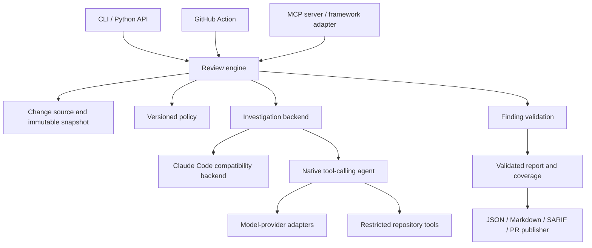

# Repository review and generic-tool assessment

Reviewed 2026-09-15 at commit `0c6a49f1fa56a1d472575da86a94dbc1edb78eda`.

This assessment records the original baseline. Subsequent fixes and implementation status are tracked in [implementation progress](implementation-progress.md).

## Executive conclusion

Implementation decisions confirmed 2026-09-15: native adapters will target OpenAI API-compatible endpoints/models and Claude models; source transmission to configured cloud providers is allowed; HIGH findings alone block CI by default, with operational errors reported separately. See the requirements and design for the implementation contract.

This repository can become a provider-independent, standalone agentic security reviewer. The most useful design is one review engine exposed through a Python API, CLI, GitHub Action, and optional MCP server. Framework-specific plugins should be thin adapters to that engine.

The reusable asset is the review workflow and security policy, rather than an existing general-purpose agent runtime. Claude Code currently supplies repository exploration, tool execution, context management, and the investigation loop. Replacing only the model name or HTTP client would not preserve those capabilities.

Functional workflow parity is achievable. Equivalent detection quality across models is unproven and requires a labeled benchmark. The repository's tests and evaluation harness do not currently establish that quality even for the existing implementation.

Keep the current Claude Code runner as a compatibility backend while extracting the engine. Add one native tool-calling backend and prove the abstraction with a second model provider before promising broad compatibility. Avoid starting with a new plugin framework or desktop UI.

## Scope and validation

Reviewed application modules, the action, slash command, reporting script, evaluation harness, tests, workflows, and customization documentation. No application behavior was changed. No live model review or GitHub publication was performed.

Validation on Windows, Python 3.13.7:

- `python -m pytest claudecode -q --tb=short`: **158 passed, 15 failed**. Ten failures arose from evaluation tests creating `~/code/audit` outside the writable workspace. Five arose during Windows cleanup of temporary directories that tests made their current directory. These are environment/test-isolation problems; they do not establish 15 scanner defects or imply Linux CI also fails.
- `bun test scripts/comment-pr-findings.bun.test.js`: **11 passed**.
- Synthetic, local probes reproduced malformed-result acceptance, an out-of-repository file read, acceptance of an error result by the evaluation harness, and incorrect `.cxx`/`.hpp` exclusions. External services were mocked; the file-read probe used disposable synthetic content.

## 1. Existing architecture

### GitHub Action path

1. `action.yml` installs Python dependencies, Node, Claude Code, `gh`, and `jq`.
2. A cached PR marker decides whether a review should run.
3. `GitHubActionClient` fetches PR metadata, changed files, and a diff.
4. `prompts.py` builds a review prompt containing the diff and research instructions.
5. `SimpleClaudeRunner` launches `claude` in the repository and extracts a JSON report from the CLI response wrapper.
6. `FindingsFilter` applies regex exclusions, then optionally calls the Anthropic API separately for each remaining finding. The API receives PR context and the referenced file's contents.
7. Python prints JSON; the action produces artifacts and a separate JavaScript program posts inline comments through `gh`.

The apparent three-phase research methodology is prompt text. Python does not explicitly orchestrate those phases or record whether each phase occurred.

### Slash-command path

`.claude/commands/security-review.md` uses Claude-specific command interpolation, tool names, and the `Task` tool. It gathers local Git information, requests an investigation subtask, requests parallel validation subtasks, applies a confidence threshold of 8/10, and emits Markdown.

It does not call the Python pipeline. Consequently there are already two implementations:

| Concern | GitHub Action | Slash command |
|---|---|---|
| Change source | GitHub PR API and checked-out repository | Local Git commands relative to `origin/HEAD` |
| Investigation | Claude Code subprocess | Host agent subtask |
| Validation | Sequential Anthropic messages API calls | Parallel host-agent subtasks |
| Validation evidence | Finding, PR metadata, one referenced file | Agent repository exploration is available |
| Confidence enforcement | Uses model `keep_finding`; no numeric cutoff enforced | Prompt asks to remove confidence below 8 |
| Result | JSON and PR comments | Markdown |
| Policy | Python prompt, regex rules, API prompt | Separate Markdown policy |

Choose the Action as the initial compatibility baseline. Treat richer agentic validation from the slash command as a separately evaluated feature.

### What is reusable

- The investigate, validate, suppress, report workflow.
- Finding fields, exclusion explanations, and basic summary concepts.
- Security guidance as a starting point for explicit policy profiles.
- GitHub acquisition/reporting behavior as adapters after correcting the defects below.
- Existing parsing and fixture tests as migration aids, with stronger contracts.
- MIT licensing permits adaptation subject to retaining required notices. Dependencies and downstream distribution still need their own license inventory.

There is no fine-tuned model, static taint engine, semantic code index, or learned feedback mechanism implemented here. The documentation's adaptive-learning language describes customization, not a training or feedback loop.

## 2. Findings that affect reliability and portability

Priorities below indicate engineering urgency, not CVSS ratings. Code locations refer to the reviewed commit.

### P1: Incomplete scans can become successful empty reports

In `claudecode/github_action_audit.py:274`, the runner returns success after extraction even if `_extract_security_findings` returns its fallback: zero findings and `review_completed: false` (`:289`). Main does not require completion before exiting successfully when there are no HIGH findings.

**Reproduced:** a valid CLI JSON wrapper containing `result: "not a valid findings report"` returns `success=True`, an empty findings list, and `review_completed=False`. Some CLI error envelopes can also reach this path.

`action.yml` captures Python failure, issues a warning, and continues. An intentionally advisory action can reasonably avoid blocking a PR, but consumers still need to distinguish execution failure from a completed clean review.

**Recommendation:** schema-validate results and require an explicit completion state. Separate scan outcome (`completed`, `partial`, `failed`, `cancelled`) from policy outcome (`pass`, `findings`). Preserve operational failures in action outputs and reports regardless of advisory/blocking mode.

### P1: Evaluation success does not establish review success or accuracy

`claudecode/evals/eval_engine.py:452` accepts parsed JSON with exit code 0 or 1. Exit code 1 is used for both high-severity findings and operational failures. `run_evaluation` then treats missing findings as an empty list.

**Reproduced:** exit code 1 plus `{"error":"Security audit failed: timeout"}` is accepted by `_run_sast_audit` as success.

`EvalCase` contains a repository, PR number, and description, but no expected findings. `detected_vulnerabilities` only means at least one finding was emitted. The harness measures invocation outcomes, not precision or recall. It also does not explicitly enable the Action's API filtering, so its default behavior differs from that baseline.

**Recommendation:** validate report state, share explicit configuration with production, pin input commits, and introduce ground-truth findings and negative cases before comparing backends.

### P1: Model-supplied file paths escape the repository boundary

`claudecode/claude_api_client.py:313` accepts absolute paths and joins relative paths to `REPO_PATH` without containment checks. A generated finding's path feeds this read, and the contents feed an API prompt before final directory exclusions.

**Reproduced:** `../outside.txt` reads a synthetic file outside the configured repository. Whether an attacker can induce a particular model output was not tested; the missing filesystem boundary is deterministic.

**Recommendation:** use a shared repository-access service restricted to a pinned snapshot. Reject absolute paths, traversal, symlink/junction escapes, nonregular files, and oversized reads. Prefer Git blob access for committed snapshots. Treat scan exclusions and data-access restrictions as different concepts.

### P1 for untrusted inputs: Execution isolation is delegated to the host

`SimpleClaudeRunner` launches Claude with the inherited process environment and only explicitly disallows `Bash(ps:*)`. The repository does not enforce a read-only tool allowlist, isolate credentials, or define a sandbox boundary. Exact effective permissions depend on the installed CLI and its configuration; this review does not claim all commands are automatically executable.

The README already restricts the Action to trusted PRs because it is not hardened against prompt injection. A generic tool must preserve that restriction until isolation is implemented.

**Recommendation:** read-only snapshots; trusted configuration outside the reviewed branch; no automatic execution of repository hooks, instructions, or tests; narrow tools; separate GitHub publishing credentials from investigation; controlled network access. Prompt instructions alone do not enforce these boundaries. Keep any executable reproductions in a separate, opt-in sandbox.

### P1: Exclusions encode unsuitable universal assumptions

`claudecode/findings_filter.py:133` recognizes only `.c`, `.cc`, `.cpp`, and `.h` for memory-safety findings.

**Reproduced:** equivalent buffer-overflow findings are retained for `.cpp` and suppressed for `.cxx` and `.hpp`. Rust findings are also suppressed without considering unsafe code or foreign-function boundaries. Broad matching can suppress a mixed-impact vulnerability merely because its description also mentions resource exhaustion or open redirects.

The API policy also makes blanket assumptions about Rust, prompt injection, UUIDs, logs, and other categories. The README advertises capabilities such as dependency and hardcoded-secret detection that downstream policy suppresses or treats inconsistently.

Custom filtering text replaces the API's default text but does not disable Python hard exclusions. Custom scanning additions likewise do not remove the main prompt's exclusions.

**Recommendation:** versioned policy profiles, explicit suppression records, and a distinction between “out of scope” and “false positive.” Preserve current exclusions in a compatibility profile, not as immutable universal rules. Validate findings about unsafe Rust and FFI on their actual evidence.

### P2: PR freshness and comment deduplication can hide new findings

`action.yml:104` skips later commits when any PR marker is restored unless `run-every-commit` is enabled. It saves a reservation before scanning (`:152`), with no successful-review check when later consuming the marker. This can suppress retries after a failed scan. A cached marker is also not an atomic lock between concurrent runs.

Separately, `scripts/comment-pr-findings.js:180` skips all new comments if it finds any prior bot security comment. Consequently enabling per-commit scans does not ensure new findings are published.

**Recommendation:** key successful result caches by repository, base/head commit, backend/model, policy, and configuration. Use actual concurrency control. Deduplicate findings individually using stable fingerprints and update resolved/outdated findings.

### P2: Incomplete file listing and unreliable inline locations

`GitHubActionClient.get_pr_data` requests only the first 100 changed files despite a pagination comment. The JavaScript publisher has the same limit (`scripts/comment-pr-findings.js:108`) and does not paginate existing comments. The full diff can still expose additional files to the model, so this is not proof the scan always misses every file after 100; it is a definite metadata and reporting limitation, made worse when the diff is omitted.

The publisher always uses the RIGHT side and the generated line number. Its fallback retries the same line without implementing the promised adjustment. Findings outside the diff can disappear from PR comments.

**Recommendation:** paginate, parse changed-line ranges, validate evidence locations, support removed-line locations where appropriate, and publish non-inline findings in a summary instead of dropping them.

### P2: Several advertised settings are not consistently applied

- `action.yml:217` exports `CLAUDE_TIMEOUT`, but `initialize_clients` constructs `SimpleClaudeRunner()` without reading it (`github_action_audit.py:390`). The configured timeout does not reach the Python subprocess deadline.
- Custom instruction paths are resolved against the Action directory after `cd "$ACTION_PATH"`, rather than the repository identified by `REPO_PATH` (`github_action_audit.py:533`). The documented relative-path examples can silently fail in a consuming repository.
- The `results-file` output says `claudecode/claudecode-results.json`, while the file is copied to the workspace as `claudecode-results.json`.
- API filtering availability is tested using a hardcoded model rather than the configured model (`claude_api_client.py:53`). Failure silently disables model validation.
- Disabled or failed validation assigns confidence 10/10 (`findings_filter.py:302`). Keeping a finding on validation failure is reasonable; labeling it maximally confident is misleading.
- GitHub HTTP calls have no explicit timeout, and the nominal scan timeout does not cover the subsequent sequential validation work.

**Recommendation:** typed configuration resolved once at entry, explicit paths, separate investigation/validation model settings, an end-to-end budget, and “unvalidated” status with unknown confidence.

### P2: Snapshot consistency and large-change coverage are implicit

PR data and diffs are fetched live while the repository checkout may correspond to an earlier event or a merge commit. The engine does not verify that these inputs refer to the same head. The repository's own SAST workflow uses checkout defaults, while the README example explicitly selects the PR head.

The large-prompt fallback removes the diff and asks the agent to explore changed files, without supplying a robust explicit base/head comparison procedure. Looking only at current files weakens the “newly introduced” requirement.

**Recommendation:** resolve immutable base/head identifiers first, verify the checkout, derive diffs from that snapshot, expose on-demand hunks, and record skipped/truncated coverage. For working-tree reviews, snapshot tracked changes and explicitly define untracked-file handling.

### P3: Packaging and test coverage need consolidation

There is no installable application manifest or public SDK contract. Environment variables and free-form dictionaries connect most components. `audit.py` simply calls the GitHub-specific main function. PyGithub is listed although the main client uses `requests`. Python dependencies and the Claude CLI installation are not version-locked.

Tests cover useful parsing, filtering, and mocked integration behavior, but not real tool exploration or detection quality. Some workflow fixtures return an unwrapped format the runner rejects, yet their assertions permit an empty result. JavaScript tests named as autofix tests assert comment text, not a generated fix; the production publisher does not implement that autofix behavior. `pytest.ini` points at a nonexistent `tests` directory, while documented CI explicitly selects `claudecode`.

Evaluation cleanup can forcibly remove locked worktrees discovered in the cache repository, beyond the current run's owned worktree. A reusable library should track ownership and never clean unrelated worktrees.

## 3. Recommended architecture

### Keep three abstractions distinct

1. **Model provider:** generates messages, requests tools, reports usage and completion reasons. It does not own policy or repository access.
2. **Agent backend:** investigates a snapshot and returns candidate findings plus coverage. A Claude Code subprocess and a native tool loop implement this interface differently.
3. **Host adapter:** lets a CLI, CI job, MCP client, or framework invoke the engine and receive its result.

Confusing these layers creates apparent portability while retaining hidden dependencies on a particular host's tools and agent behavior.

Suggested core contracts:

| Contract | Responsibility |
|---|---|
| `ReviewRequest` | Snapshot, scope, policy version, backend, budgets |
| `ChangeSource` | Base/head, changed files, hunks, rename/deletion information |
| `RepositoryReader` | Bounded reads/searches at the approved snapshot |
| `InvestigationBackend` | Discover candidates and report coverage/errors |
| `FindingValidator` | Confirm/reject/mark uncertain with evidence and reasons |
| `ReviewReport` | Schema version, status, findings, suppressions, provenance, usage |
| `Publisher` | Render or publish validated reports; no investigation credentials |

Use a consistent confidence scale and keep confidence separate from severity. Include source locations, evidence, attack preconditions, base/head provenance, validation status, stable fingerprint, and suppression rule IDs. Record model/backend versions and policy hashes to make comparisons meaningful.

### Native standalone workflow

1. Resolve configuration and freeze a repository snapshot.
2. Collect changed-file metadata and bounded diff chunks.
3. Investigate with a model/tool loop using `list_files`, `read_file`, `search`, `get_diff`, and `read_at_revision`.
4. Validate candidate structure and evidence locations before further processing.
5. Review candidates in fresh validation contexts with bounded repository exploration; start sequentially, then introduce controlled concurrency if measurements justify it.
6. Apply explicit policy, preserve suppression reasons, and deduplicate.
7. Emit a report with completion state, coverage, errors, latency, and usage.
8. Publish separately when requested.

The difficult implementation work is context selection, truncation recovery, tool-result size limits, deadlines/cancellation, and evidence validation. Sending the entire diff in a single API request does not substitute for repository exploration.

A small explicit Python state machine is sufficient to start. If durable execution, resumption, and streaming become requirements, LangGraph is a possible internal orchestration implementation; keep its types out of the public contracts. Its official documentation describes these runtime capabilities: [LangGraph overview](https://docs.langchain.com/oss/python/langgraph/overview).

## 4. Standalone app versus plugins

| Option | Benefit | Limitation | Assessment |
|---|---|---|---|
| Portable prompt/skill pack | Fastest reuse of security guidance | Host controls execution, validation, and output consistency | Useful companion, insufficient for measured parity |
| Multiple coding-CLI backends | Reuses existing exploration agents | CLI formats, permissions, authentication, and context behavior vary | Good transitional strategy |
| Standalone engine and CLI | Owns policy, execution, reports, and reproducibility | Must implement restricted tools and an agent loop | Recommended foundation |
| Framework-native implementations | Natural integration in each framework | Duplicates workflow and allows policy drift | Prefer thin wrappers |
| MCP server around the engine | Portable discovery and invocation for compatible clients | Does not itself supply reasoning or guarantee universal host support | Recommended additional surface |

“Any agentic framework” is too broad as a compatibility promise. Offer a versioned Python interface and JSON CLI first, MCP for compatible hosts, and small adapters elsewhere. Test and publish a supported capability matrix.

### Two different plugin modes

**Engine-owned execution:** the host calls `start_review`; the service owns the investigation model, tools, budgets, and policy. The host retrieves a structured result. This best preserves consistent behavior across frameworks but needs separately configured model access.

**Host-owned execution:** the plugin supplies policy, prompts, and repository tools; the host's agent does the investigation. This can reuse the host's model access, but behavior and quality depend on that host. Do not present it as interchangeable with the engine-owned mode without independent evaluation.

MCP supports tool input schemas and structured results with output schemas. That is a useful interoperability contract, not an agent runtime or a guarantee that model output follows a schema. See the [MCP tools specification](https://modelcontextprotocol.io/specification/2025-11-25/server/tools).

For long reviews, expose `start_review`, `get_review_status`, `get_review_result`, and `cancel_review` so clients need not hold one call open. A remote service should use approved repository identifiers and immutable revisions, not arbitrary client-supplied filesystem paths. Publishing should remain a separate operation.

Internal extension points can cover model providers, agent backends, source hosts, policy packs, and publishers. Start with explicit registration and optional dependencies. Arbitrary installed Python plugins execute code; isolation must be designed separately if third-party plugins are untrusted.

## 5. Migration sequence and acceptance criteria

### Phase 1: Establish a trustworthy baseline

Fix error/completion semantics, path confinement, configuration resolution, pagination, comment deduplication, snapshot consistency, and test isolation. Define the compatibility policy and freeze representative inputs.

**Exit criterion:** failures cannot appear as completed clean reviews; configuration examples work; safe synthetic regressions cover the confirmed defects.

### Phase 2: Extract the engine without changing backend

Introduce typed request/report contracts, repository access, policy, and publishers. Move environment parsing into entry points. Keep Claude Code and Anthropic validation behind adapters. Make the GitHub Action invoke the same library API as a new local CLI.

**Exit criterion:** the CLI can review explicit local base/head revisions without GitHub credentials, and the Action produces the same normalized results from recorded fixtures.

### Phase 3: Add a native agent backend

Implement read-only tools, provider message translation, schema validation, bounded repair, usage/deadline limits, and separate candidate validation. Add a second provider to expose hidden provider assumptions.

**Exit criterion:** backend contract tests pass; investigations can trace a vulnerability across files; truncation and rate-limit failures remain visible; comparison against the baseline meets agreed quality and cost thresholds.

### Phase 4: Expose integrations

Add MCP and one real framework adapter, Markdown/SARIF exporters, then additional source hosts if needed. A UI can follow once the job/result API is stable.

**Exit criterion:** CLI, CI, and adapters call the same engine, return the same report schema, and enforce equivalent cancellation, error, and access boundaries.

### Evaluation required for functional equivalence

- Pin repository and base/head commits, policies, backend versions, and model identifiers.
- Use positive and negative examples, including multi-file authorization flaws, injection, unsafe Rust/FFI, large diffs, deleted/renamed files, generated-looking comments, and prompt-injection attempts.
- Label expected vulnerabilities and acceptable locations; distinguish newly introduced from preexisting issues.
- Measure precision, recall by category, location correctness, duplicate rate, completion/coverage, runtime, and usage/cost.
- Evaluate investigation and validation separately so reduced alert counts are not mistaken for better accuracy.
- Repeat runs to measure variation; use held-out cases and human adjudication of disagreements.
- Verify policy compatibility separately from improvements: correcting an overbroad exclusion should not be scored as a regression merely because the legacy tool missed the finding.

There is insufficient evidence for a defensible calendar estimate without a target deployment model and quality bar. Relative effort is clear: contract extraction and a CLI are smaller than building and evaluating a native investigation backend; the MCP wrapper is small after the engine exists; a secure multi-user hosted service is a separate, larger scope.

## Final recommendation

Proceed with a standalone Python review engine and CLI, retain Claude Code as the first backend, then add a native agent backend and MCP surface. Unify policy and reporting before multiplying integrations. The key go/no-go milestone is measured detection quality and trustworthy completion reporting, not the number of supported frameworks.
